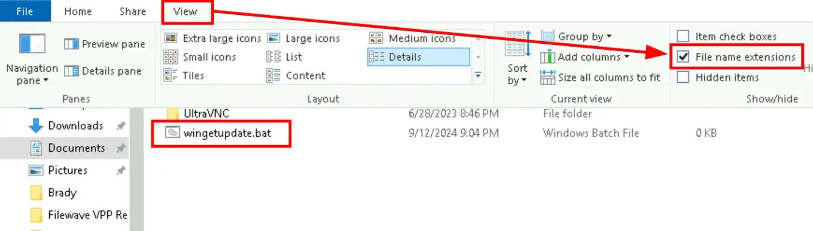
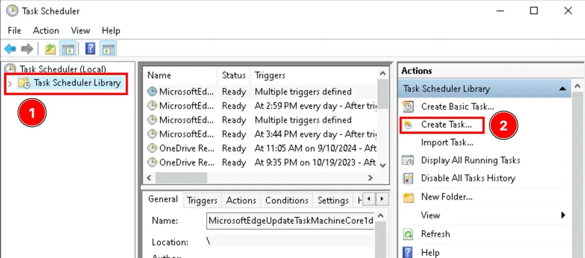
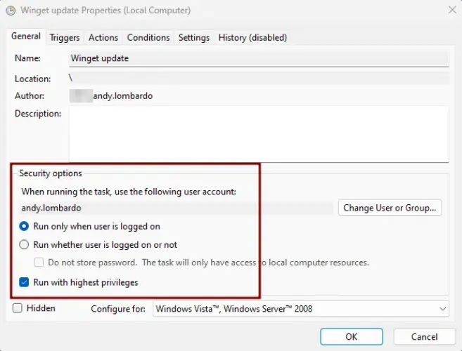
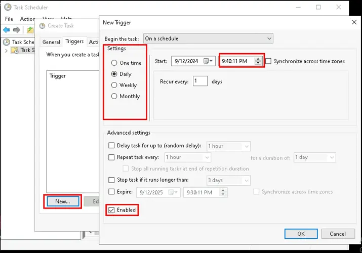
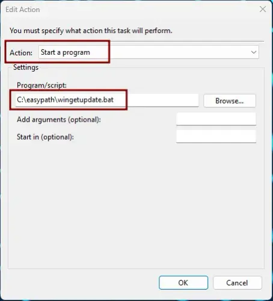
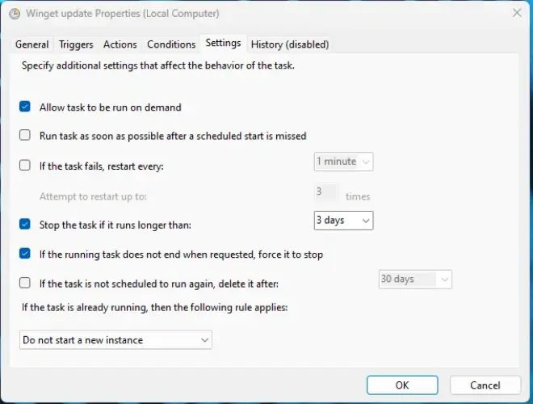
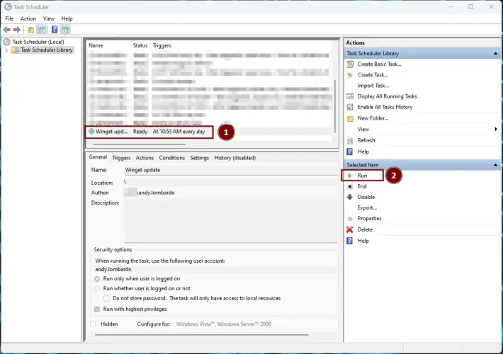
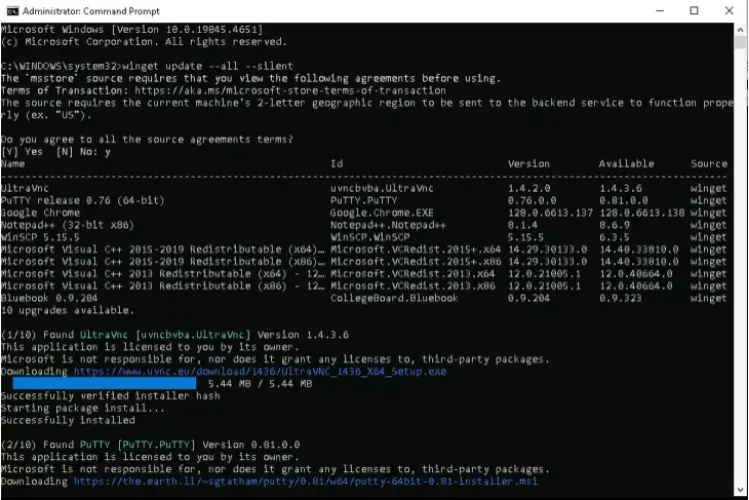
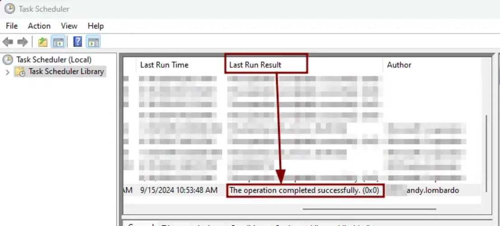

# Windows 11

## Installation

https://hardware-helden.de/windows-11-ohne-internet-und-ohne-microsoft-konto-installieren
https://www.gamingdeputy.com/gr/so-entfernen-sie-das-symbol-weitere-informationen-zu-diesem-bild-unter-windows-11/
https://www.windowspage.de/tipps/024131.html
https://www.windowspage.de/tipps/022065.html
https://de.minitool.com/datentraegerverwaltung/tpm-loeschen.html

## Updates

### WinGet

The Windows Package Manager (also known as winget) is a free and open-source package manager designed by Microsoft for Windows 10 and Windows 11. It consists of a command-line utility and a set of services for installing applications. Independent software vendors can use it as a distribution channel for their software packages.

https://learn.microsoft.com/en-us/windows/package-manager/winget/

The "winget source update" updates a source.

```cmd
winget source update
```

The "winget upgrade" command checks each installed software or app for a new version and then displays it in a table. The list only includes software applications that have an active update.

```cmd
winget upgrade
```

You can now decide whether you want to upgrade a single application or automatically update the entire software list. You can then update a single Windows app with the following command.

```cmd
winget upgrade -g --id „APPLICATION-ID“
```

If you want to update the entire list of apps that need updates, the following WinGet command is necessary.

```cmd
winget upgrade --all --silent
```

WinGet's upgrade parameter has numerous parameters. You can access help using the following command.

```cmd
winget upgrade -?
```

| Option            | Description                                                                                                                      |
| ----------------- | -------------------------------------------------------------------------------------------------------------------------------- |
| -m, --manifest    | Must follow the path to the manifest (YAML) file. You can use the manifest to perform the upgrade from a local YAML file.        |
| --id              | Restricts the upgrade to the application ID.                                                                                     |
| --Name            | Restricts the search to the application name.                                                                                    |
| --moniker         | Filter results by moniker                                                                                                        |
| -v, --version     | Allows you to specify an exact version for the upgrade. If not specified, les upgrades the application with the highest version. |
| -s, --source      | Restricts the search to the specified source name. This must be followed by the source name.                                     |
| -e, --exakt       | Uses the exact string in the query, including case-sensitivity checking. It does not use the default substring behavior.         |
| -i, --interactive | Runs the installer in interactive mode. By default, the installer's progress is displayed.                                       |
| -h, --silent      | Runs the installer in silent mode. This suppresses the entire user interface. By default, the installer's progress is displayed. |
| -o, --log         | Redirects logging to a log file. You must specify a path to a file for which you have write permissions.                         |
| --override        | Redirects logging to a log file. You must specify a path to a file for which you have write permissions.                         |
| -l, --location    | Location to save the upgrade (if supported).                                                                                     |
| --force           | If a hash mismatch is detected, ignore the error and attempt to install the package.                                             |
| --all             | Updates all available packages to the latest application.                                                                        |
| --include-unknown | Attempt to update a package even if the current version of the package is unknown.                                               |

### WingetUI

https://www.marticliment.com/unigetui/

### WinGet Scheduled Task

To create the batch file, open Notepad and enter the following text:

- winget source update
- winget upgrade --all --silent

Next, save as wingetupdate.bat.



Once the batch file is ready, you can test it by right-clicking on it and selecting Run As Administrator. If all is good, it will launch the CLI, pop up with a single UAC prompt for approval, and then run the update command.

Now that the batch file is tested and ready, open the Task Scheduler app. This is a pre-installed Windows app, so it should already be on your device. Click on Task Scheduler Library and then select Create Task…



On the Create Task screen, on the General tab give the task a descriptive name, then select “Run with the highest privileges” option, which is critical if you don’t want to have multiple UAC prompts. For my scenarios, I also leave this set to “Run only when user is logged on” as it doesn’t play well with the running whether user is logged on or not option.



On the Trigger tab, click new, select a frequency and time, and make sure the “Enabled” box is checked.



On the Actions tab, click New, then select “Start a program” and browse for the batch file we previously saved and click OK.



On the Settings tab the defaults should be acceptable, but can be tweaked based on your needs. To be able to test it, make sure “Allow task to be run on demand” is checked. Click OK when you’re done. Mine is set like this:



Now, in Task Scheduler, click on the newly created task to select it, then click Run.



When this runs, a CLI window should pop up and run with no need for intervention. It should disappear when it finishes running.



Under the Last Run Result column in Task Scheduler, you should now see “The operation completed successfully” like below:



## Security

### Bitlocker

BitLocker is a volume encryption technology that was first introduced in Windows Vista and Windows Server 2008. Like other Microsoft products, it also suffers from certain glitches, but many people around the globe rely on BitLocker Drive Encryption (BDE) to protect their data at rest.

#### BitLocker PowerShell Module

To view the various commands offered by the BitLocker module, run the following command:

```powershell
Get-Command -Module BitLocker
```

#### BitLocker Installation

This command installs BitLocker (including all subfeatures and management tools) and then restarts the server to complete the installation.

```powershell
Install-WindowsFeature BitLocker -IncludeAllSubFeature -IncludeManagementTools -Restart
```

#### BitLocker Volumes

To get information about the volumes (or drives) that BitLocker drive encryption can protect on your computer, use the following command:

```powershell
Get-BitLockerVolume
```

## Backup

```

```
