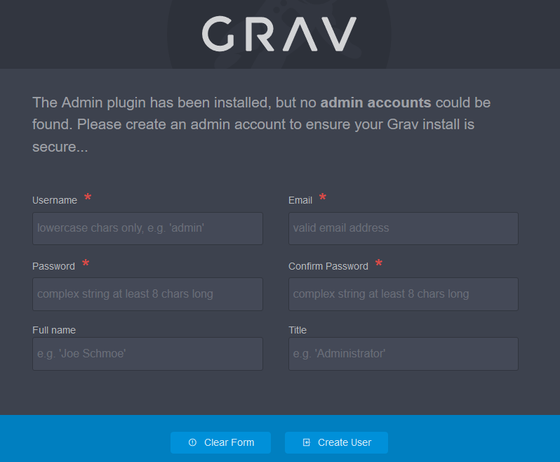
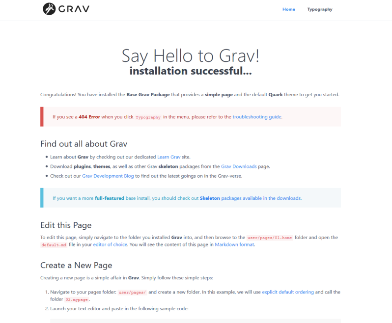

# Grav

```
your-server-ip-address > [IPADDRESS]
your-server-url > [URL]
your-server-name > [SERVER]
your-user-name > [USER]
your-user-password > [PASSWORD]
your-user-database > [DATABASE]
your-user-email > [EMAIL]
```

## Requirements

### Webserver

```bash
sudo apt install apache2
sudo systemctl enable apache2
sudo systemctl restart apache2
sudo systemctl status apache2
```

```bash
sudo apt install -y php php-{cli fpm common curl gd json mbstring xml zip opcache apcu} unzip
sudo php -v
```

## Installation & Configuration

```bash
sudo apt install wget unzip
```

```bash
sudo wget sudo wget https://getgrav.org/download/core/grav-admin/grav.zip
sudo unzip grav.zip
sudo mv grav/ /var/www/html/
csudo hown -R www-data:www-data /var/www/html/grav
sudo rm grav.zip
sudo rm /var/www/html/index.html
```

```bash
sudo nano /etc/apache2/sites-available/grav.conf
```

```
<VirtualHost *:80>
	ServerAdmin [EMAIL]
	DocumentRoot /var/www/html/grav
	ServerName [URL]

	<Directory /var/www/html/grav/>
		Options FollowSymLinks
		AllowOverride All
		Require all granted
	</Directory>

	ErrorLog ${APACHE_LOG_DIR}/error.log
	CustomLog ${APACHE_LOG_DIR}/access.log combined
</VirtualHost>
```

```bash
sudo a2ensite grav.conf
sudo a2dissite 000-default.conf
sudo a2enmod rewrite
sudo apachectl configtest
sudo systemctl restart apache2
sudo systemctl status apache2
```

> **Note:**
> http://[IPADDRESS]





## Security & Performance

### PHP

```bash
sudo cp /etc/php/8.*/apache2/php.ini /etc/php/8.*/apache2/php.ini.original
sudo cp /etc/php/8.*/fpm/php.ini /etc/php/8.*/fpm/php.ini.original

sudo nano /etc/php/8.*/apache2/php.ini
sudo nano /etc/php/8.*/fpm/php.ini
```

```
;;;;;;;;;;;
; EXAMPLE ;
;;;;;;;;;;;

[PHP]

;;;;;;;;;;;;;;;;;;;;
; Language Options ;
;;;;;;;;;;;;;;;;;;;;

engine = On
short_open_tag = Off
precision = 14
output_buffering = Off
zlib.output_compression = On
zlib.output_compression_level = 5
implicit_flush = Off
serialize_precision = -1
disable_functions = allow_url_fopen,curl_exec,curl_multi_exec,exec,openlog,parse_ini_filew_source,passthru,phpinfo,popen,proc_open,shell_exec,show_source,syslog,system,highlight_file,fopen_with_path,dbmopen,dbase_open,putenv,chdir,filepro,filepro_rowcount,filepro_retrieve,posix_mkfifo
zend.enable_gc = On
zend.exception_ignore_args = On
zend.exception_string_param_max_len = 0
cgi.force_redirect= On

;;;;;;;;;;;;;;;;;
; Miscellaneous ;
;;;;;;;;;;;;;;;;;

expose_php = Off
allow_webdav_methods = Off
max_input_vars = 1500
realpath_cache_size = 16M
realpath_cache_ttl = 120
opcache.enable = 1
zend_extension = opcache

;;;;;;;;;;;;;;;;;;;
; Resource Limits ;
;;;;;;;;;;;;;;;;;;;

max_execution_time = 360
max_input_time = 60
memory_limit = 512M

;;;;;;;;;;;;;;;;;;;;;;;;;;;;;;
; Error handling and logging ;
;;;;;;;;;;;;;;;;;;;;;;;;;;;;;;

error_reporting = E_ALL
display_errors = Off
display_startup_errors = Off
log_errors = On
error_log = /var/log/apache2/php_scripts_error.log
ignore_repeated_errors = Off
ignore_repeated_source = Off
report_memleaks = On
track_errors = Off
html_errors = Off

;;;;;;;;;;;;;;;;;
; Data Handling ;
;;;;;;;;;;;;;;;;;

variables_order = "GPCS"
request_order = "GP"
register_argc_argv = Off
auto_globals_jit = On
post_max_size = 100M
auto_prepend_file =
auto_append_file =
default_mimetype = "text/html"
default_charset = "UTF-8"

;;;;;;;;;;;;;;;;;;;;;;;;;
; Paths and Directories ;
;;;;;;;;;;;;;;;;;;;;;;;;;

enable_dl = Off
file_uploads = On
upload_max_filesize = 100M
max_file_uploads = 5

;;;;;;;;;;;;;;;;;;
; Fopen wrappers ;
;;;;;;;;;;;;;;;;;;

allow_url_fopen = Off
allow_url_include = Off
default_socket_timeout = 60

;;;;;;;;;;;;;;;;;;;
; Module Settings ;
;;;;;;;;;;;;;;;;;;;

[CLI Server]
cli_server.color = On

[Date]
date.timezone = Europe/Berlin

[mail function]
SMTP = localhost
smtp_port = 25
mail.add_x_header = Off

[ODBC]
odbc.allow_persistent = On
odbc.check_persistent = On
odbc.max_persistent = -1
odbc.max_links = -1
odbc.defaultlrl = 4096
odbc.defaultbinmode = 1

[MySQLi]
mysqli.max_persistent = -1
mysqli.allow_persistent = On
mysqli.max_links = -1
mysqli.default_port = 3306
mysqli.reconnect = Off

[mysqlnd]
mysqlnd.collect_statistics = On
mysqlnd.collect_memory_statistics = Off

[PostgreSQL]
pgsql.allow_persistent = On
pgsql.auto_reset_persistent = Off
pgsql.max_persistent = -1
pgsql.max_links = -1
pgsql.ignore_notice = 0
pgsql.log_notice = 0

[bcmath]
bcmath.scale = 0

[Session]
session.save_handler = files
session.save_path = /var/lib/php/sessions
session.use_strict_mode = 1
session.use_cookies = 1
session.use_only_cookies = 1
session.name = NEW_SSID
session.auto_start = 0
session.cookie_lifetime = 0
session.cookie_secure = 1
session.cookie_httponly = 1
session.cookie_samesite = Strict
session.serialize_handler = php
session.gc_probability = 0
session.gc_divisor = 1000
session.gc_maxlifetime  = 600
session.cache_limiter = public
session.cache_expire = 180
session.use_trans_sid = 0
session.sid_length = 256
session.trans_sid_tags = "a=href,area=href,frame=src,form="
session.sid_bits_per_character = 6

[Assertion]
zend.assertions = -1

[Tidy]
tidy.clean_output = Off

[soap]
soap.wsdl_cache_enabled = 1
soap.wsdl_cache_dir = "/tmp"
soap.wsdl_cache_ttl = 86400
soap.wsdl_cache_limit = 5

[ldap]
ldap.max_links = -1
```

### Grav

```bash
sudo nano /var/www/html/grav/user/config/system.yaml
```

```yaml
force_ssl: true # Use HTTPS only (redirect from HTTP -> HTTPS)

cache:
  enabled: true # Greatly speeds up the site
  check:
    method: hash # Optimization, disables file modification checks for pages

twig:
  cache: true # Greatly speeds up the site
  debug: false # We do not want to display debug messages
  auto_reload: false # Optimization, disables file modification checks for twig files
  autoescape: true # Protects from many XSS attacks, but requires twig updates if used in older sites/themes/plugins

errors:
  display: 0 # Display only a simple error
  log: true # Log errors for later inspection

debugger:
  enabled: false # Never keep debugger enabled in a live site.
  censored: true # In case if you happen to enable debugger, avoid displaying sensitive information

session:
  enabled: true # NOTE: Disable sessions if you do not use user login and/or forms.
  secure: true # Use this as your site should be using HTTPS only
  httponly: true # Protects session cookies against client side scripts and XSS
  samesite: Strict # Prevent all cross-site scripting attacks
  split: true # Separate admin session from the site session for added security

strict_mode: # Test your site before changing these. Removes backward compatibility and improves site security.
  yaml_compat: false
  twig_compat: false
  blueprint_compat: false
```

## Backup

### Files

```bash
sudo systemctl enable cron
sudo crontab -e
```

```
# Every Monday on 02:00 AM
0 2 * * 1   tar -cvf backup_grav_$(date "+%d-%b-%y").tar /var/www/html/grav
```

## Themes [^1] [^2] [^3] [^4] [^5] [^6]

### The Content

The /user/pages folder is where all of the content pages live. Each page is placed in its own folder, and folder names should reflect the page’s name, and also be a valid slug.

You can order pages by naming the page folders with a preceding number: 01.home, 02.blog. Page folders then contain a markdown file and media for the page. The name of the markdown file will reference the name of the theme’s template to be used to render the content, for example: home.md would look for a template named home.html.twig.

### The Theme

Themes can be found within the /user/themes folder. For a theme to function you’ll need:

- blueprints.yaml – a file which contains information about the theme.
- themename.php – a file which contains any logic your theme needs.
- themename.yaml – a configuration file used by the plugin to set options the theme might use.
- templates/ – a folder containing the Twig templates to render the pages.

You should also include and these are required if you plan to release a theme:

- CHANGELOG.md – a file that follows the Grav Changelog Format to show changes.
- LICENSE – a file containing the license to the theme.
- README.md – a file with documentation for the theme.
- screenshot.jpg – a 1009px x 1009px screenshot of the theme.
- thumbnail.jpg – a 300px x 300px screenshot of the theme.

This is also where the css, sass, fonts, images, and js folders for the theme reside.

### The Templates

Templates can be found in the /user/themes/themename/templates folder. These templates are Twig templates and will be used to render your pages.

### The Blueprints

Blueprints are located in the /user/themes/themename/blueprints folder. The files within this folder are YAML files used to extend and modify the admin plugin with custom forms to make updating the website simpler.

### Folder Structure Example

```
themename
├── css
│ └── style.css
├── js
│ └── script.js
├── images
│ ├── favicon.ico
│ └── logo.png
├── fonts
│ └── font.woff2
├── templates
│ ├── partials
│ │ ├── base.html.twig            // html & body Block-Part
│ │ ├── header.html.twig          // header Block-Part
│ │ ├── nav.html.twig             // nav Block-Part
│ │ ├── aside.html.twig           // aside Block-Part
│ │ └── footer.html.twig          // footer Block-Part
│ ├── home.html.twig              // Home Page-Template
│ ├── default.html.twig           // Default Page-Template
│ ├── blog.html.twig              // Blog Page-Template
│ ├── item.html.twig              // Item Page-Template
│ └── error.html.twig             // Error Page-Template
├── blueprints.yaml
├── themename.php
├── themename.yaml
├── screenshot.jpg
└── thumbnail.jpg
```

### Shortcodes

#### themename.yaml

```yaml
enabled: true
default_lang: en
dropdown:
  enabled: true
```

#### themename.php

```php
<?php
namespace Grav\Theme;

use Grav\Common\Theme;

class Simple extends Theme
{
    // Access plugin events in this class
}
```

#### blueprints.yaml

```yaml
name: Themename
slug: themename
type: theme
version: 1.0.0
description: "Default theme for Grav"
icon: empire
author:
  name: Team
  email: fake@mail.com
  url: localhost
homepage: localhost
demo: localhost
keywords: simple, theme, core, modern, fast, responsive, html5, css3
bugs: localhost
license: MIT

dependencies:
  - { name: grav, version: ">=1.7.0" }

form:
  validation: strict
  fields:
    dropdown.enabled:
      type: toggle
      label: Dropdown in Navigation
      highlight: 1
      default: 1
      options:
        1: Enabled
        0: Disabled
      validate:
        type: bool
```

#### navigation

```

  
    
    <li class="{{ current_page }}">
      <a href="{{ page.url }}">{{ page.menu }}</a>
    </li>
  

```

#### content

```

    {{ page.content|raw }}

```

#### blog-posts

```
{# blog post collection #}

{# date format #}

{# number of items per page #}

{# pagination #}



  {{ item.url }}"

  {{ item.date|date(dateformat) }}

  {{ item.title }}

  
  {# page media as thumbnail #}
  
    {{ image.html|raw }}
  


{# include the pagination bar #}

  

```

#### Blog Page - Expert Mode - Content > Add

```
title: Blog
admin: { }
content:
items: '@self.children'
order:
by: header.publish_date
dir: desc
pagination: true
```

[^1]: https://www.developerdrive.com/how-to-build-your-own-theme-for-grav-cms/
[^2]: https://www.tutorialspoint.com/grav/index.htm
[^3]: https://learn.getgrav.org/17/themes/theme-basics
[^4]: https://learn.getgrav.org/17/cookbook/tutorials/create-a-blog
[^5]: https://learn.getgrav.org/17/content/collections#collection-object
[^6]: https://github.com/getgrav/grav-plugin-pagination
