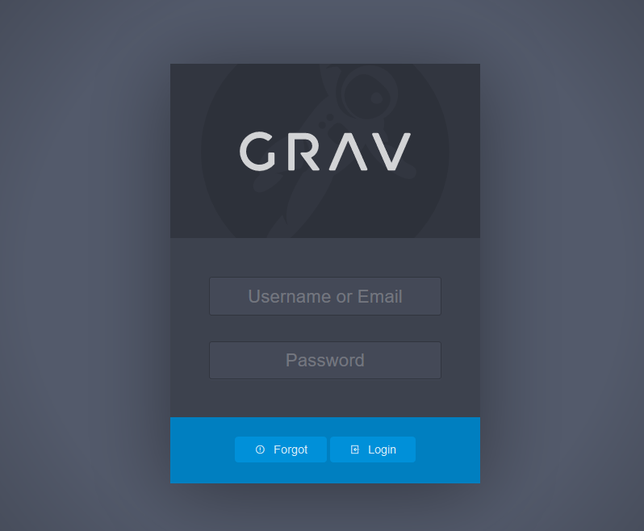

# WordPress

## Installation

### Requirements

```bash
sudo apt install apache2
sudo systemctl enable apache2
sudo systemctl status apache2
```

```bash
sudo apt install -y php php-cli php-fpm php-common php-curl php-gd php-json php-mbstring php-xml php-zip php-opcache php-apcu unzip -y
sudo php -v
```

```bash
sudo nano /etc/php/8.3/fpm/php.ini
    memory_limit = 256M
    upload_max_filesize = 100M
    max_execution_time = 360
    max_input_vars = 1500
    date.timezone = Your_Timezone (make sure you uncomment this line, remove the ; in front of the line)
```

### Configuration

```bash
sudo apt install wget unzip
```

```bash
sudo wget sudo wget https://getgrav.org/download/core/grav-admin/grav.zip
sudo unzip grav.zip
sudo mv grav/ /var/www/html/
csudo hown -R www-data:www-data /var/www/html/grav
sudo rm grav.zip
sudo rm /var/www/html/index.html
```

```
http://your-server-ip-address
```





## Security

```bash
sudo nano /var/www/html/grav/user/config/system.yaml
```

```yaml
force_ssl: true # Use HTTPS only (redirect from HTTP -> HTTPS)

cache:
  enabled: true # Greatly speeds up the site
  check:
    method: hash # Optimization, disables file modification checks for pages

twig:
  cache: true # Greatly speeds up the site
  debug: false # We do not want to display debug messages
  auto_reload: false # Optimization, disables file modification checks for twig files
  autoescape: true # Protects from many XSS attacks, but requires twig updates if used in older sites/themes/plugins

errors:
  display: 0 # Display only a simple error
  log: true # Log errors for later inspection

debugger:
  enabled: false # Never keep debugger enabled in a live site.
  censored: true # In case if you happen to enable debugger, avoid displaying sensitive information

session:
  enabled: true # NOTE: Disable sessions if you do not use user login and/or forms.
  secure: true # Use this as your site should be using HTTPS only
  httponly: true # Protects session cookies against client side scripts and XSS
  samesite: Strict # Prevent all cross-site scripting attacks
  split: true # Separate admin session from the site session for added security

strict_mode: # Test your site before changing these. Removes backward compatibility and improves site security.
  yaml_compat: false
  twig_compat: false
  blueprint_compat: false
```

## Backup

### Files

```bash
sudo systemctl enable cron
sudo crontab -e
```

```
# Every Monday on 02:00 AM
0 2 * * 1   tar -cvf backup_grav_$(date "+%d-%b-%y").tar /var/www/html/grav
```

## Themes [^1] [^2]

### The Content

```
The /user/pages folder is where all of the content pages live. Each page is placed in its own folder, and folder names should reflect the page’s name, and also be a valid slug.

You can order pages by naming the page folders with a preceding number: 01.home, 02.blog. Page folders then contain a markdown file and media for the page. The name of the markdown file will reference the name of the theme’s template to be used to render the content, for example: home.md would look for a template named home.html.twig.
```

### The Theme

```
Themes can be found within the /user/themes folder. For a theme to function you’ll need:

- blueprints.yaml – a file which contains information about the theme.
- themename.php – a file which contains any logic your theme needs.
- themename.yaml – a configuration file used by the plugin to set options the theme might use.
- templates/ – a folder containing the Twig templates to render the pages.

You should also include and these are required if you plan to release a theme:

- CHANGELOG.md – a file that follows the Grav Changelog Format to show changes.
- LICENSE – a file containing the license to the theme.
- README.md – a file with documentation for the theme.
- screenshot.jpg – a 1009px x 1009px screenshot of the theme.
- thumbnail.jpg – a 300px x 300px screenshot of the theme.

This is also where the css, sass, fonts, images, and js folders for the theme reside.
```

### The Templates

```
Templates can be found in the /user/themes/themename/templates folder. These templates are Twig templates and will be used to render your pages.
```

### The Blueprints

```
Blueprints are located in the /user/themes/themename/blueprints folder. The files within this folder are YAML files used to extend and modify the admin plugin with custom forms to make updating the website simpler.
```

### Folder Structure Example

```
themename
├── css
│	└── style.css
├── js
│	└── script.js
├── images
│	├── favicon.ico
│	└── logo.png
├── fonts
│	└── font.woff2
├── templates
│	├── partials
│ │	├── base.html.twig
│ │	├── header.html.twig
│ │	├── nav.html.twig
│ │	├── aside.html.twig
│ │	└── footer.html.twig
│	├── home.html.twig
│	├── default.html.twig
│	└── error.html.twig
├── blueprints.yaml
├── themename.php
├── themename.yaml
├── screenshot.jpg
└── thumbnail.jpg
```

### Shortcodes

[^1]: https://www.developerdrive.com/how-to-build-your-own-theme-for-grav-cms/
[^2]: https://www.tutorialspoint.com/grav/index.htm
