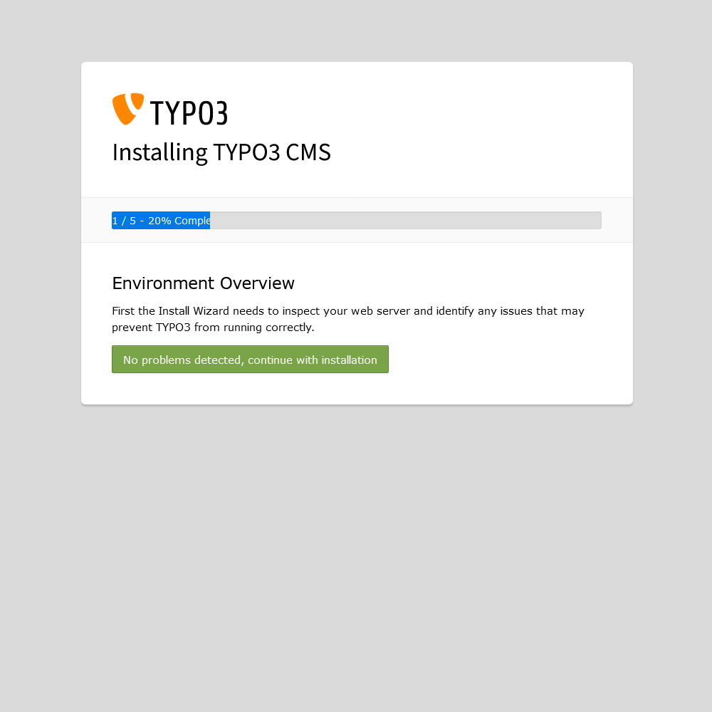
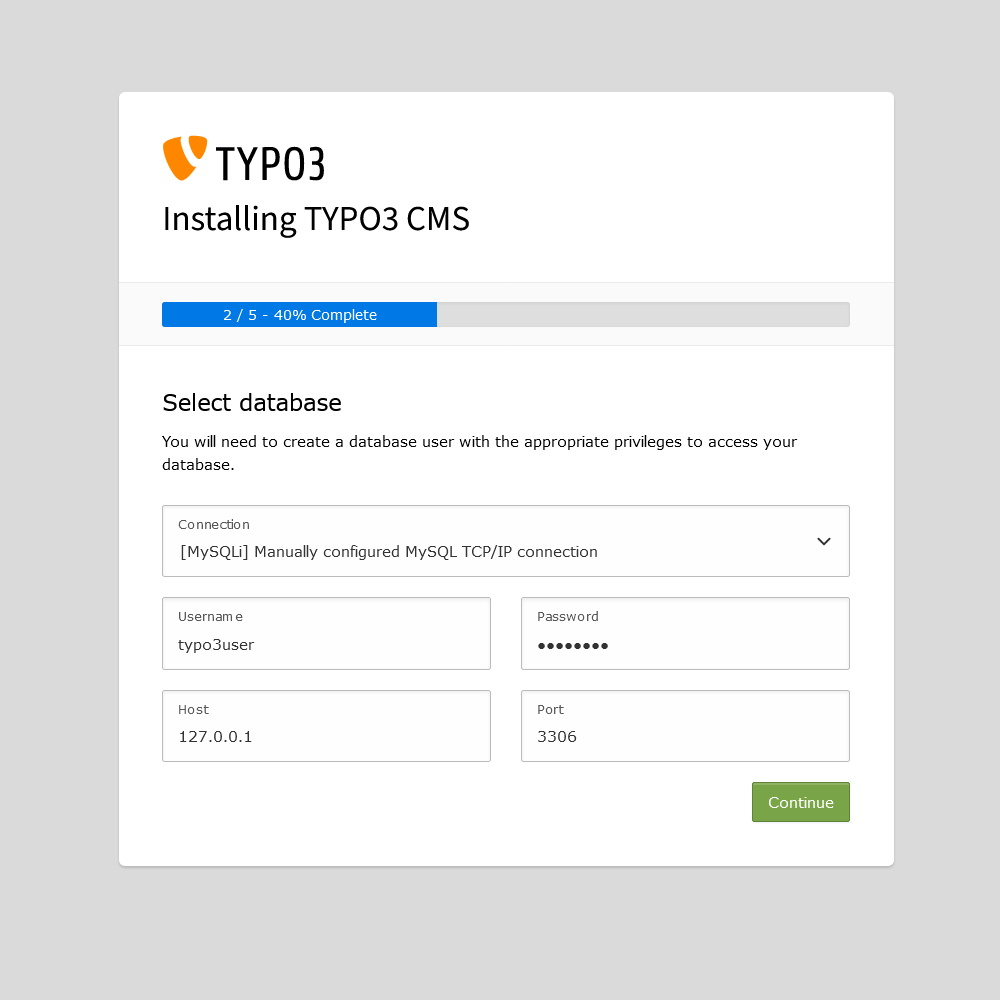
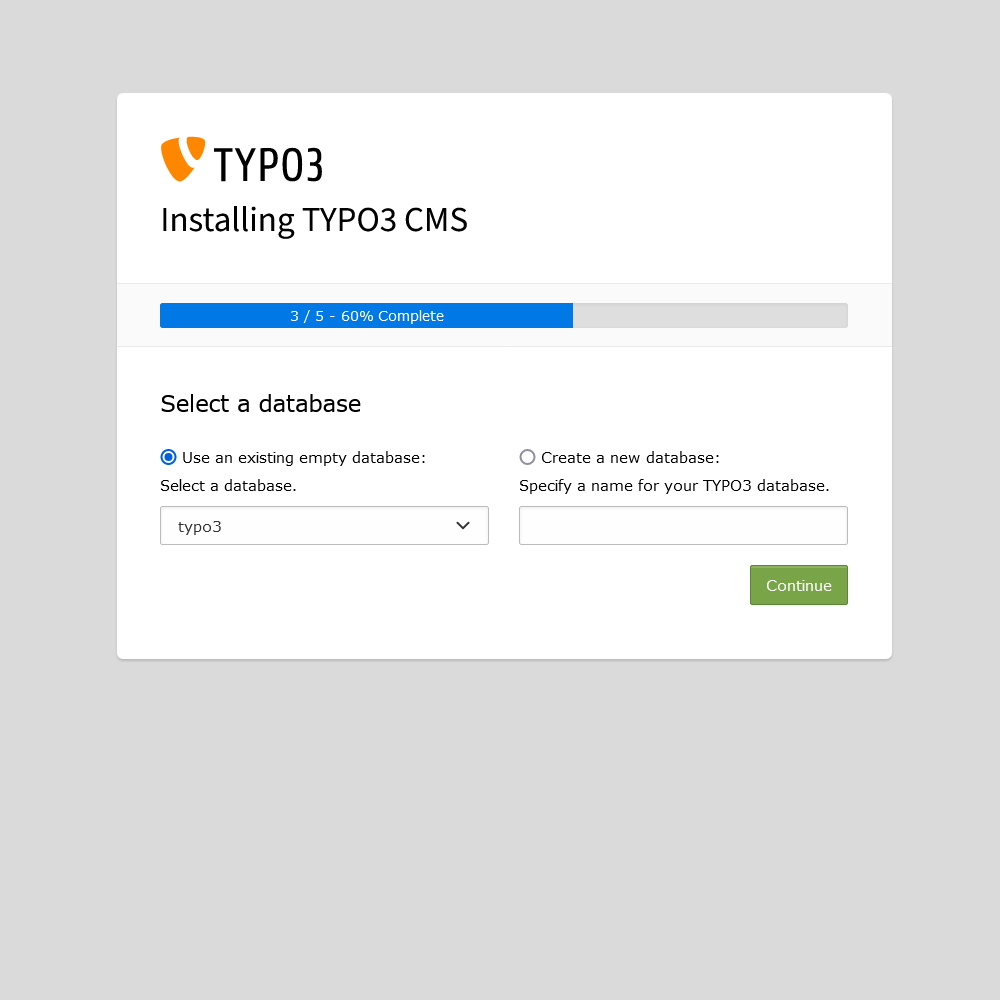
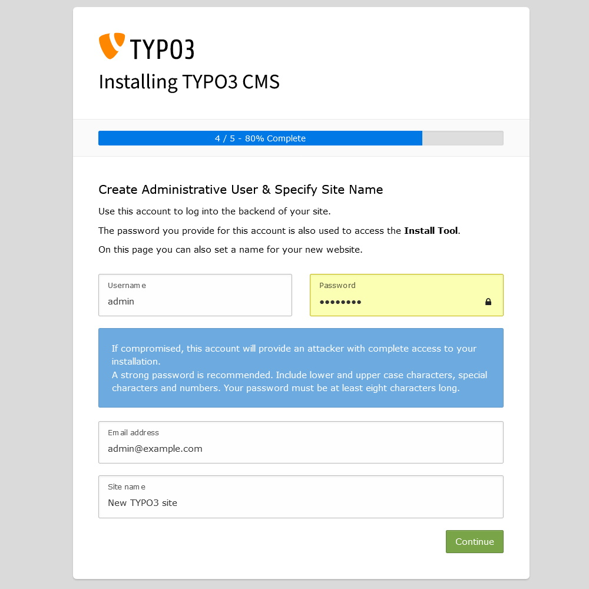
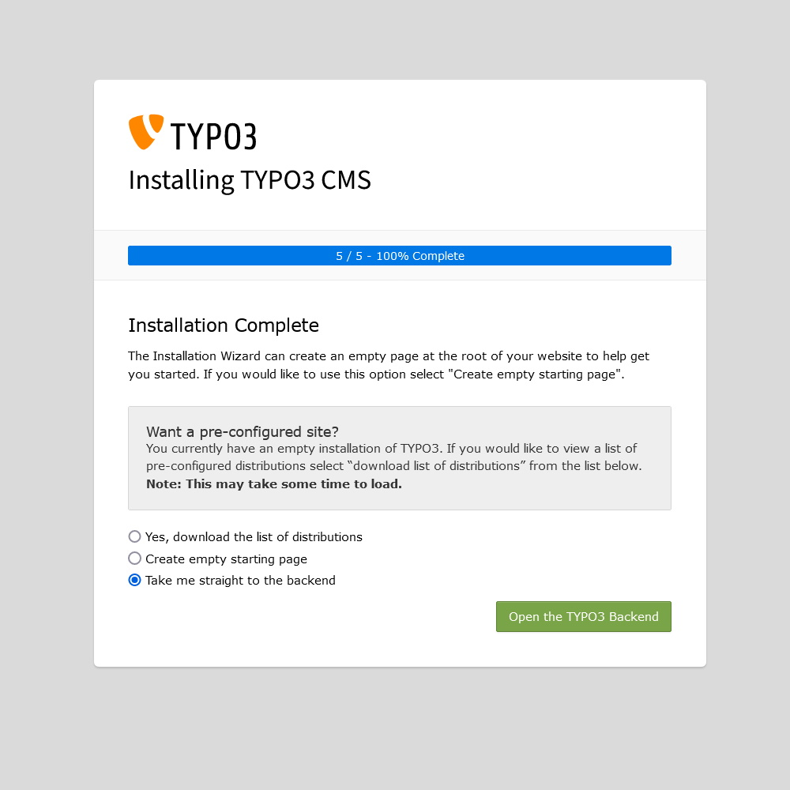
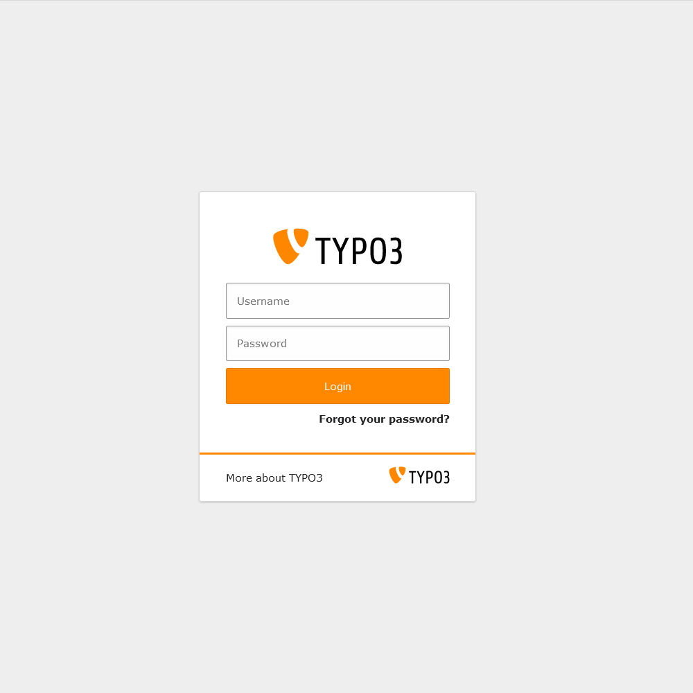

# Typo3

## Installation

### Requirements

```bash
sudo apt install apache2
sudo systemctl enable apache2
sudo a2enmod deflate rewrite headers mime expires
sudo systemctl status apache2
```

```bash
sudo apt install -y php php-{apcu,bcmath,common,mysql,xml,xmlrpc,curl,gd,cli,mbstring,soap,zip,intl,json}
sudo php -v
```             

```bash
sudo apt install imagemagick
```

```bash
sudo apt install mariadb-server mariadb-client
sudo systemctl enable --now mariadb
sudo systemctl status mariadb
```

```bash
sudo mysql_secure_installation

Enter current password for root (enter for none): Press ENTER
Set root password? [Y/n]: Y
New password: Set-your-new-password
Re-enter new password: Set-your-new-password
Remove anonymous users? [Y/n] Y
Disallow root login remotely? [Y/n] Y
Remove test database and access to it? [Y/n] Y
Reload privilege tables now? [Y/n] Y
```

```bash
sudo mysql -u root -p

CREATE USER 'typo3user'@'localhost' IDENTIFIED BY 'your_password';
CREATE DATABASE typo3;
GRANT ALL PRIVILEGES ON typo3.* TO 'typo3user'@'localhost';
FLUSH PRIVILEGES;
EXIT;
```

### Installation & Configuration

```bash
sudo apt install wget unzip
```

```bash
sudo wget https://get.typo3.org/11.5.13/zip
sudo unzip zip
sudo mv typo3_src-11.5.13/ /var/www/html/typo3
sudo rm zip
sudo rm /var/www/html/index.html
```

```bash
sudo nano /var/www/html/typo3/FIRST_INSTALL
sudo chown -R www-data:www-data /var/www/html/typo3/
sudo find /var/www/html/typo3/ -type d -exec chmod 755 {} \;
sudo find /var/www/html/typo3/ -type f -exec chmod 644 {} \;
```

```bash
sudo nano /etc/apache2/sites-available/typo3.conf
```

```
<VirtualHost *:80>
	ServerAdmin admin@example.com
	DocumentRoot /var/www/html/typo3
	ServerName example.com
	ServerAlias www.example.com
	
	<Directory /var/www/html/typo3/>
		Options FollowSymlinks
		AllowOverride All
		Require all granted
	</Directory>
	
	ErrorLog ${APACHE_LOG_DIR}/error.log
	CustomLog ${APACHE_LOG_DIR}/access.log combined
</VirtualHost>
```

```bash
sudo a2ensite typo3.conf
sudo a2dissite 000-default.conf
sudo systemctl restart apache2
```

```
http://your-server-ip-address
```








## Security

### Folder Accesss

```bash
sudo chown -R www-data:www-data /var/www/html/typo3/
sudo find /var/www/html/typo3/ -type d -exec chmod 2775 {} \;
sudo find /var/www/html/typo3/ -type f -exec chmod 0664 {} \;
```

### Access Restrictions

```bash
sudo chmod 750 /var/www/html/typo3/typo3temp/var/log/
sudo chmod 750 /var/www/html/typo3/typo3temp/var/session/
sudo chmod 750 /var/www/html/typo3/typo3temp/var/tests/
sudo chmod 640 /var/www/html/typo3/.git/index
sudo chmod 640 /var/www/html/typo3/INSTALL.md
sudo chmod 640 /var/www/html/typo3/INSTALL.txt
sudo chmod 640 /var/www/html/typo3/ChangeLog
sudo chmod 640 /var/www/html/typo3/composer.json
sudo chmod 640 /var/www/html/typo3/composer.lock
sudo chmod 640 /var/www/html/typo3/vendor/autoload.php
sudo chmod 640 /var/www/html/typo3/typo3_src/Build/package.json
sudo chmod 640 /var/www/html/typo3/typo3_src/bin/typo3
sudo chmod 640 /var/www/html/typo3/typo3_src/INSTALL.md
sudo chmod 640 /var/www/html/typo3/typo3_src/INSTALL.txt
sudo chmod 640 /var/www/html/typo3/typo3_src/ChangeLog
sudo chmod 640 /var/www/html/typo3/typo3_src/vendor/autoload.php
sudo chmod 640 /var/www/html/typo3/typo3conf/LocalConfiguration.php
sudo chmod 640 /var/www/html/typo3/typo3conf/AdditionalConfiguration.php
sudo chmod 640 /var/www/html/typo3/typo3/sysext/core/composer.json
sudo chmod 640 /var/www/html/typo3/typo3/sysext/core/ext_tables.sql
sudo chmod 640 /var/www/html/typo3/typo3/sysext/core/Configuration/Services.yaml
sudo chmod 640 /var/www/html/typo3/typo3/sysext/extbase/ext_typoscript_setup.txt
sudo chmod 640 /var/www/html/typo3/typo3/sysext/extbase/ext_typoscript_setup.typoscript
sudo chmod 640 /var/www/html/typo3/typo3/sysext/felogin/Configuration/FlexForms/Login.xml
sudo chmod 640 /var/www/html/typo3/typo3/sysext/backend/Resources/Private/Language/locallang.xlf
sudo chmod 640 /var/www/html/typo3/typo3/sysext/backend/Tests/Unit/Utility/Fixtures/clear.gif
sudo chmod 640 /var/www/html/typo3/typo3/sysext/belog/Configuration/TypoScript/setup.txt
sudo chmod 640 /var/www/html/typo3/typo3/sysext/belog/Configuration/TypoScript/setup.typoscript
```

### Limit PHP Functions

```bash
php -i | grep allow_url_include
    allow_url_include => Off => Off
```

### Modify your PHP.ini

```bash
sudo cp /etc/php/8.1/apache2/php.ini /etc/php/8.1/apache2/php.ini.original
sudo nano /etc/php/8.1/apache2/php.ini
```

```
;;;;;;;;;;;
; EXAMPLE ;
;;;;;;;;;;;

[PHP]

;;;;;;;;;;;;;;;;;;;;
; Language Options ;
;;;;;;;;;;;;;;;;;;;;

engine = On
short_open_tag = Off
precision = 14
output_buffering = Off
zlib.output_compression = Off
implicit_flush = Off
serialize_precision = -1
disable_functions = allow_url_fopen,curl_exec,curl_multi_exec,exec,openlog,parse_ini_filew_source,passthru,phpinfo,popen,proc_open,shell_exec,show_source,syslog,system,highlight_file,fopen_with_path,dbmopen,dbase_open,putenv,chdir,filepro,filepro_rowcount,filepro_retrieve,posix_mkfifo
zend.enable_gc = On
zend.exception_ignore_args = On
zend.exception_string_param_max_len = 0
cgi.force_redirect= On

;;;;;;;;;;;;;;;;;
; Miscellaneous ;
;;;;;;;;;;;;;;;;;

expose_php = Off
allow_webdav_methods = Off
max_input_vars = 1500

;;;;;;;;;;;;;;;;;;;
; Resource Limits ;
;;;;;;;;;;;;;;;;;;;

max_execution_time = 240
max_input_time = 60
memory_limit = 512M

;;;;;;;;;;;;;;;;;;;;;;;;;;;;;;
; Error handling and logging ;
;;;;;;;;;;;;;;;;;;;;;;;;;;;;;;

error_reporting = E_ALL
display_errors = Off
display_startup_errors = Off
log_errors = On
error_log = /var/log/apache2/php_scripts_error.log
ignore_repeated_errors = Off
ignore_repeated_source = Off
report_memleaks = On
track_errors = Off
html_errors = Off

;;;;;;;;;;;;;;;;;
; Data Handling ;
;;;;;;;;;;;;;;;;;

variables_order = "GPCS"
request_order = "GP"
register_argc_argv = Off
auto_globals_jit = On
post_max_size = 100M
auto_prepend_file =
auto_append_file =
default_mimetype = "text/html"
default_charset = "UTF-8"

;;;;;;;;;;;;;;;;;;;;;;;;;
; Paths and Directories ;
;;;;;;;;;;;;;;;;;;;;;;;;;

enable_dl = Off
file_uploads = On
upload_max_filesize = 100M
max_file_uploads = 5

;;;;;;;;;;;;;;;;;;
; Fopen wrappers ;
;;;;;;;;;;;;;;;;;;

allow_url_fopen = Off
allow_url_include = Off
default_socket_timeout = 60

;;;;;;;;;;;;;;;;;;;
; Module Settings ;
;;;;;;;;;;;;;;;;;;;

[CLI Server]
cli_server.color = On

[Date]
date.timezone = Europe/Berlin

[mail function]
SMTP = localhost
smtp_port = 25
mail.add_x_header = Off

[ODBC]
odbc.allow_persistent = On
odbc.check_persistent = On
odbc.max_persistent = -1
odbc.max_links = -1
odbc.defaultlrl = 4096
odbc.defaultbinmode = 1

[MySQLi]
mysqli.max_persistent = -1
mysqli.allow_persistent = On
mysqli.max_links = -1
mysqli.default_port = 3306
mysqli.reconnect = Off

[mysqlnd]
mysqlnd.collect_statistics = On
mysqlnd.collect_memory_statistics = Off

[PostgreSQL]
pgsql.allow_persistent = On
pgsql.auto_reset_persistent = Off
pgsql.max_persistent = -1
pgsql.max_links = -1
pgsql.ignore_notice = 0
pgsql.log_notice = 0

[bcmath]
bcmath.scale = 0

[Session]
session.save_handler = files
session.use_strict_mode = 1
session.use_cookies = 1
session.use_only_cookies = 1
session.name = NEW_SSID
session.auto_start = 0
session.cookie_lifetime = 0
session.cookie_secure = 1
session.cookie_httponly = 1
session.cookie_samesite = Strict
session.serialize_handler = php
session.gc_probability = 0
session.gc_divisor = 1000
session.gc_maxlifetime  = 600
session.cache_limiter = nocache
session.cache_expire = 30
session.use_trans_sid = 0
session.sid_length = 256
session.trans_sid_tags = "a=href,area=href,frame=src,form="
session.sid_bits_per_character = 6

[Assertion]
zend.assertions = -1

[Tidy]
tidy.clean_output = Off

[soap]
soap.wsdl_cache_enabled = 1
soap.wsdl_cache_dir = "/tmp"
soap.wsdl_cache_ttl = 86400
soap.wsdl_cache_limit = 5

[ldap]
ldap.max_links = -1
```

## Backup

### Manually

#### Files

```bash
sudo systemctl enable cron
sudo crontab -e
```

```
# Every Monday on 02:00 AM
0 2 * * 1   tar -cvf backup_typo3_$(date "+%d-%b-%y").tar /var/www/html/typo3
```

#### Database

```bash
sudo systemctl enable cron
sudo crontab -e
```

```
# Every Monday on 02:00 AM
0 2 * * 1   mysqldump -u [USERNAME] -p [DATABASE] > backup_typo3_$(date "+%d-%b-%y").sql
```

## Fluid Template Sitepackage [^1] [^2]

### Folder Structure Example

path:   typo3_installation/typo3conf/ext/site_package/

```
site_package
├── Configuration
│	├── TCA
│	│	└── Overrides
│	│		└── sys_template.php
│	└── TypoScript
│		├── constants.typoscript
│		├── setup.typoscript
│		└── Setup
│			└── Page.typoscript
├── Resources
│   ├── Private
│   │   ├── Language
│   │   ├── Layouts
│   │   │   └── Page
│   │   ├── Partials
│   │   │   └── Page
│   │   │   	├── Header.html
│   │   │   	├── Nav.html
│   │   │   	├── Main.html
│   │   │   	├── Aside.html
│   │   │   	└── Footer.html
│   │   ├── Templates
│   │   │   └── Page
│   │   │   	└── Default.html
│   │   └── .htaccess
│   └── Public
│       ├── Css     
│       │   └── custom.css
│       ├── Images
│       │   └── logo.png
│       ├── JavaScript
│       |   └── custom.js
│       ├── Fonts
│       |   └── custom.woff2
│       ├── Icons
│       |   └── custom.ico
│       └── Scss
│           └── custom.scss
├── composer.json
├── ext_emconf.php
└── ext_localconf.php
```

#### Language
- The directory Language/ may contain .xlf files that are used for the localization of labels and text strings (frontend as well as backend) by TYPO3. This topic is not strictly related to the Fluid template engine and is documented in section Internationalization and Localization.

#### Layouts

- HTML files, which build the overall layout of the website, are stored in the Layouts/ folder. Typically this is only one construct for all pages across the entire website. Pages can have different layouts of course, but page layouts do not belong into the Layout/ directory. They are stored in the Templates/ directory (see below). In other words, the Layouts/ directory should contain the global layout for the entire website with elements which appear on all pages (e.g. the company logo, navigation menu, footer area, etc.). This is the skeleton of your website.

#### Templates

- The most important fact about HTML files in the Templates/ directory has been described above already: this folder contains layouts, which are page- specific. Due to the fact that a website usually consists of a number of pages and some pages possibly show a different layout than others (e.g. number of columns), the Templates/ directory may contain one or multiple HTML files.

#### Partials

- The directory called Partials/ may contain small snippets of HTML template files. "Partials" are similar to templates, but their purpose is to represent small units, which are perfect to fulfil recurring tasks. A good example of a partial is a specially styled box with content that may appear on several pages. If this box would be part of a page layout, it would be implemented in one or more HTML files inside the Templates/ directory. If an adjustment of the box is required at one point in the future, this would mean that several template files need to be updated. However, if we store the HTML code of the box as a small HTML snippet into the Partials/ directory, we can include this snippet at several places. An adjustment only requires an update of the partial and therefore in one file only. 

- The use of partials is optional, whereas files in the Layouts/ and Templates/ directories are mandatory for a typical sitepackage extension. 

- The sitepackage extension described in this tutorial focuses on the implementation of pages, rather than specific content elements. Therefore, folders Layouts/, Templates/ and Partials/ all show a sub- directory Page/.
Language

- The directory Language/ may contain .xlf files that are used for the localization of labels and text strings (frontend as well as backend) by TYPO3. This topic is not strictly related to the Fluid template engine and is documented in section Internationalization and Localization.

#### .htaccess

```
Order deny,allow
Deny from all
```

#### Default.html

```
<div class="wrapper">
    <f:render partial="Nav.html" arguments="{_all}"/>
    <f:render partial="Header.html" arguments="{_all}"/>
    <f:render partial="Main.html" arguments="{_all}"/>
    <f:render partial="Aside.html" arguments="{_all}"/>
    <f:render partial="Footer.html" arguments="{_all}"/>
</div>
```

#### Nav.html

```
<nav>
    <div class="row">
        <div>
            <button id="hamburger" onclick="toggleMobileMenu()">
                <span></span>
                <span></span>
                <span></span>
                <span></span>
            </button>
            <span>MENU</span>
        </div>

        <div id="menu">
            <ul class="main-menu">
                <f:for each="{mainMenu}" as="mainMenuItem">
                    <li class="menu-item {f:if(condition:'{mainMenuItem.children}',then:'dropdown')} {f:if(condition: mainMenuItem.active, then:'active')}">
                        <f:if condition="{mainMenuItem.children}">
                            <f:then>
                                <!-- Item has children -->
                                <a class="menu-link dropdown-toggle" data-toggle="dropdown" href="#" role="button" aria-haspopup="true" aria-expanded="false">{mainMenuItem.title}</a>
                                <ul class="sub-menu">
                                    <f:for each="{mainMenuItem.children}" as="subMenuItem">
                                        <li class="sub-menu-item {f:if(condition: mainMenuItem.children.active, then:'active')}">
                                            <a class="submenu-link" href="{subMenuItem.link}" target="{subMenuItem.target}" title="{subMenuItem.title}">{subMenuItem.title}</a>
                                        </li>
                                    </f:for>
                                </ul> 
                            </f:then>
                    
                            <f:else>
                                <!-- Item has no children -->
                                <a class="menu-link" href="{mainMenuItem.link}" target="{mainMenuItem.target}" title="{mainMenuItem.title}">{mainMenuItem.title}</a>
                            </f:else>
                        </f:if>
                    </li>
                </f:for>
            </ul>
        </div>
    </div>
</nav>
```

#### Header.html

```
<header>
    <div class="row">
        <div class="title">
            title not found
        </div>
        <div>
            <f:if condition="{languageMenu}">
                <ul id="language" class="language-menu">
                    <f:for each="{languageMenu}" as="item">
                    <li class="{f:if(condition: item.active, then: 'active')} {f:if(condition: item.available, else: ' text-muted')}">
                        <f:if condition="{item.available}">
                            <f:then>
                                <a href="{item.link}" hreflang="{item.hreflang}" title="{item.navigationTitle}"><span>{item.navigationTitle}</span></a>
                            </f:then>
                            <f:else>
                                <span>{item.navigationTitle}</span>
                            </f:else>
                        </f:if>
                    </li>
                    </f:for>
                </ul>
            </f:if>
        </div>
    </div>
</header>
```

#### Main.html

```
<main>
    <div class="row">
        <f:if condition="{breadcrumb}">
            <ol class="breadcrumb">
                <f:for each="{breadcrumb}" as="item">
                    <li class="breadcrumb-item{f:if(condition: item.current, then: ' active')}" >
                        <f:if condition="{item.current}">
                            <f:then>
                                <span class="divider">&raquo;</span><span class="breadcrumb-text">{item.title}</span>
                            </f:then>
                            <f:else>
                                <a class="breadcrumb-link" href="{item.link}" title="{item.title}"><span class="breadcrumb-text">{item.title}</span></a>
                            </f:else>
                        </f:if>
                    </li>
                </f:for>
            </ol>
        </f:if>   
    </div>
    <div class="row">
        <f:for each="{mainContent}" as="contentElement">
            <f:cObject typoscriptObjectPath="tt_content.{contentElement.data.CType}" data="{contentElement.data}" table="tt_content"/>
        </f:for>
    </div>
</main>
```

#### Aside.html

```

```

#### Footer.html

```

```

#### sys_template.php

```
<?php

	defined('TYPO3') or die();

	$extensionKey = 'site_package';

	\TYPO3\CMS\Core\Utility\ExtensionManagementUtility::addStaticFile(
		$extensionKey,
		'Configuration/TypoScript/',
		'Fluid Content Elements'
	);
```

#### constants.typoscript

```
@import 'EXT:fluid_styled_content/Configuration/TypoScript/constants.typoscript'

page {
  fluidtemplate {
    layoutRootPath = EXT:site_package/Resources/Private/Layouts/Page/
    partialRootPath = EXT:site_package/Resources/Private/Partials/Page/
    templateRootPath = EXT:site_package/Resources/Private/Templates/Page/
  }
}
```

#### setup.typoscript

```
@import 'EXT:fluid_styled_content/Configuration/TypoScript/setup.typoscript'
@import 'EXT:site_package/Configuration/TypoScript/Setup/*.typoscript'
```

#### Page.typoscript

```
page = PAGE

// Part 1: Global Site Configuration

config {
   pageTitleSeparator = -
   pageTitleSeparator.noTrimWrap = | | |

   admPanel = 1
}

// Part 2: Meta Tags

page {
   meta {
      X-UA-Compatible = IE=edge
      X-UA-Compatible.attribute = http-equiv
      author = AUTHORNAME
      description = DESCRIPTION
      keywords = KEYWORD
   }
}

// Part 3: Open Graph Tags

page {
   meta {
      og:title = OG-TITLE
      og:title.attribute = property
      og:site_name = OG-SITENAME
      og:site_name.attribute = property
      og:description = OG:DESCRIPTION
      og:description.attribute = property
      og:locale = en_GB
      og:locale.attribute = property
      og:image.cObject = IMG_RESOURCE
      og:image.cObject.file = EXT:site_package/Resources/Public/Images/og_image.png
      og:url = https://www.yourserver.url
   }
}

// Part 4: CSS

page {
   includeCSS {
      file_01 = EXT:site_package/Resources/Public/Css/reset.css
      file_02 = EXT:site_package/Resources/Public/Css/custom.css
      file_03 = https://cdnjs.cloudflare.com/ajax/libs/font-awesome/4.7.0/css/font-awesome.min.css
      file_04 = https://cdn.jsdelivr.net/gh/jpswalsh/academicons@1/css/academicons.min.css
   }
}

// Part 5: Favicon

page {
   shortcutIcon = EXT:site_package/Resources/Public/Icons/favicon.ico
}

// Part 6: Fluid Template

page {
   10 = FLUIDTEMPLATE
   10 {
         templateName = Default
		 
         templateRootPaths {
            0 = EXT:site_package/Resources/Private/Templates/Page/
         }
         partialRootPaths {
            0 = EXT:site_package/Resources/Private/Partials/Page/
         }
         layoutRootPaths {
            0 = EXT:site_package/Resources/Private/Layouts/Page/
         }

		dataProcessing {
         // Part 6.1: Navigation Menu
			10 = TYPO3\CMS\Frontend\DataProcessing\MenuProcessor
         10 {
            levels = 2
            expandAll = 1
            includeSpacer = 1
            as = mainMenu
         }

			// Part 6.2: Breadcrumbs
         20 = TYPO3\CMS\Frontend\DataProcessing\MenuProcessor
         20 {
            special = rootline
            special.range = 0|-1
            includeNotInMenu = 0
            begin = 2
            as = breadcrumb
         }

			// Part 6.3: Language Menu
         30 = TYPO3\CMS\Frontend\DataProcessing\LanguageMenuProcessor
         30 {
            languages = auto
            as = languageMenu
         }

			// Part 6.4: Main Content
			40 = TYPO3\CMS\Frontend\DataProcessing\DatabaseQueryProcessor
			40 {
				table = tt_content
				orderBy = sorting
				where = colPos = 0
				as = mainContent
			}
		}
	}
}

// Part 7: JavaScript

page {
  includeJSFooter {
      jquery = https://code.jquery.com/jquery-3.6.3.slim.min.js
      jquery.external = 1
      file_01 = EXT:site_package/Resources/Public/JavaScript/custom.js
  }
}
```

#### composer.json

```json
{
	"name": "brand/site-package",
	"type": "typo3-cms-extension",
	"description": "Example site package from the site package tutorial",
	"authors": [{"name": "Your Name", "role": "Developer", "homepage": "https://yourserver.url"}],
	"require": {"typo3/cms-core": "^12.0.0|dev-main", "typo3/cms-fluid-styled-content": "^12.0.0|dev-main"},
	"homepage": "https://yourserver.url",
    "license": ["GPL-2.0-or-later"],
	"keywords": ["typo3", "site package"],
	"autoload": {"psr-4": {"Brand\\OwnPackage\\": "Classes/"}},
	"extra": {"typo3/cms": {"extension-key": "site_package"}}
}
```

#### ext_emconf.php

```php
<?php
	$EM_CONF[$_EXTKEY] = [
		'title' => 'TYPO3 Site Package',
		'description' => 'TYPO3 Site Package',
		'category' => 'templates',
		'author' => 'your name',
		'author_email' => 'your mail',
		'author_company' => 'your company',
		'version' => '1.0.0',
		'state' => 'stable',
		'constraints' => [
			'depends' => [
				'typo3' => '12.0.0-12.99.99',
				'fluid_styled_content' => '12.0.0-12.99.99'
			],
			'conflicts' => [
			],
		],
		'uploadfolder' => 0,
		'createDirs' => '',
		'clearCacheOnLoad' => 1
	];
```

### ext_localconf.php

```php
<?php
    use TYPO3\CMS\Core\Utility\ExtensionManagementUtility;
    defined('TYPO3') or die();
```

## Extension installation without composer

```
If TYPO3 has been installed the legacy way, by extracting the source package into the web directory without using PHP composer follow this tutorial for installation of the site-package extension:
By using this method, extensions (e.g. the sitepackage extension) can be installed using the Extension Manager, which is a module found in the backend of TYPO3.
It is highly recommended that you work locally on your machine using for example ddev.
Copy the directory site_package (including all files and sub-directories) to the following directory in your TYPO3 instance: typo3conf/ext/.
You can also create a ZIP file of the content of your site_package folder and name it site_package.zip. It is important that the ZIP archive does not contain the directory site_package and its files and directories inside this folder. The files and folders must be directly located on the first level of ZIP archive.
```

## Extension installation with Extension manager

```
First of all, login at the backend of TYPO3 as a user with administrator privileges. At the left side you find a section Admin Tools with a module Extensions. Open this module and make sure, the drop down box on the right hand side shows Installed Extensions. If you have already uploaded the site package extension, search for "Site Package". If you created a ZIP file, upload the ZIP'ed extension by clicking the upload icon. Once the site package extension appears in the list, you can activate it by clicking the "plus" icon.
```

[^1]: https://docs.typo3.org/m/typo3/tutorial-sitepackage/main/en-us/
[^2]: https://docs.typo3.org/m/typo3/tutorial-sitepackage/main/en-us/Summary/Index.html