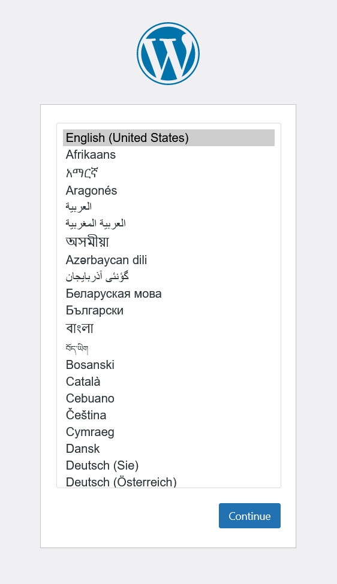
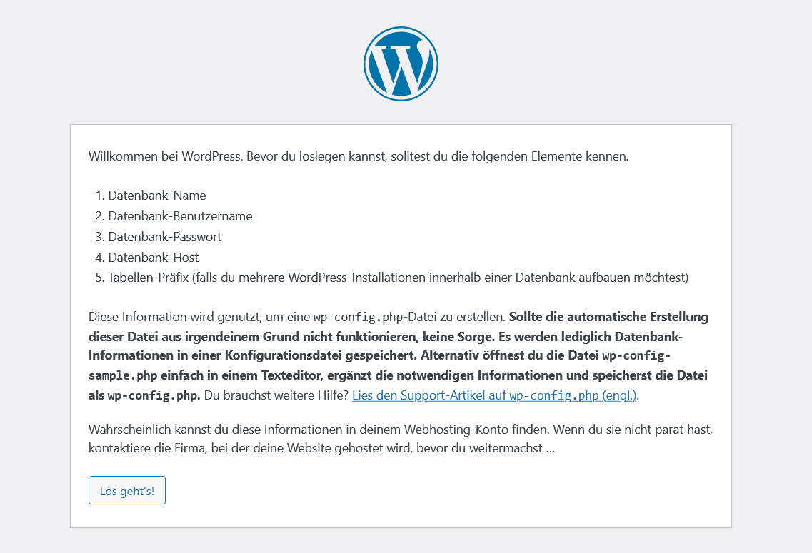
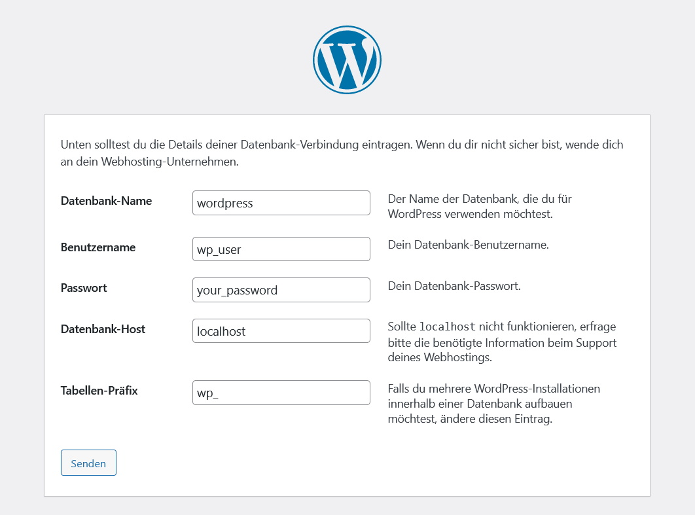
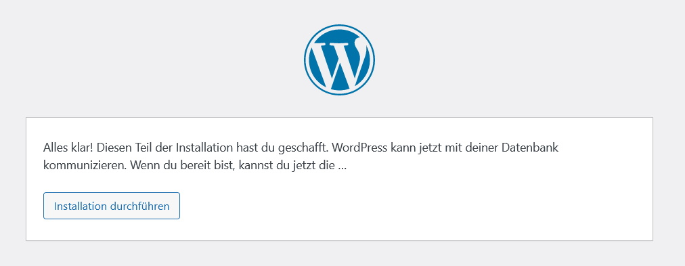
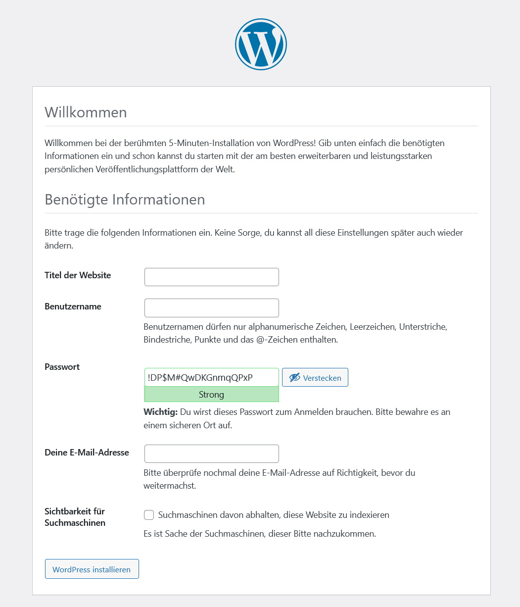
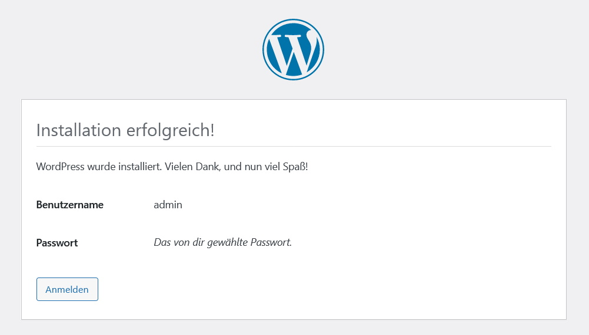
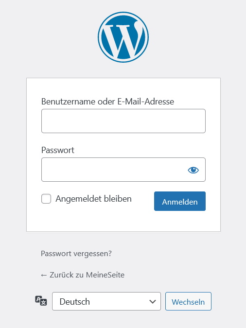
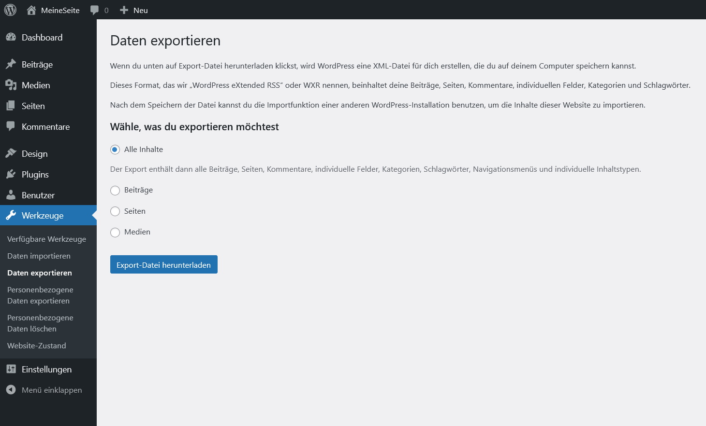
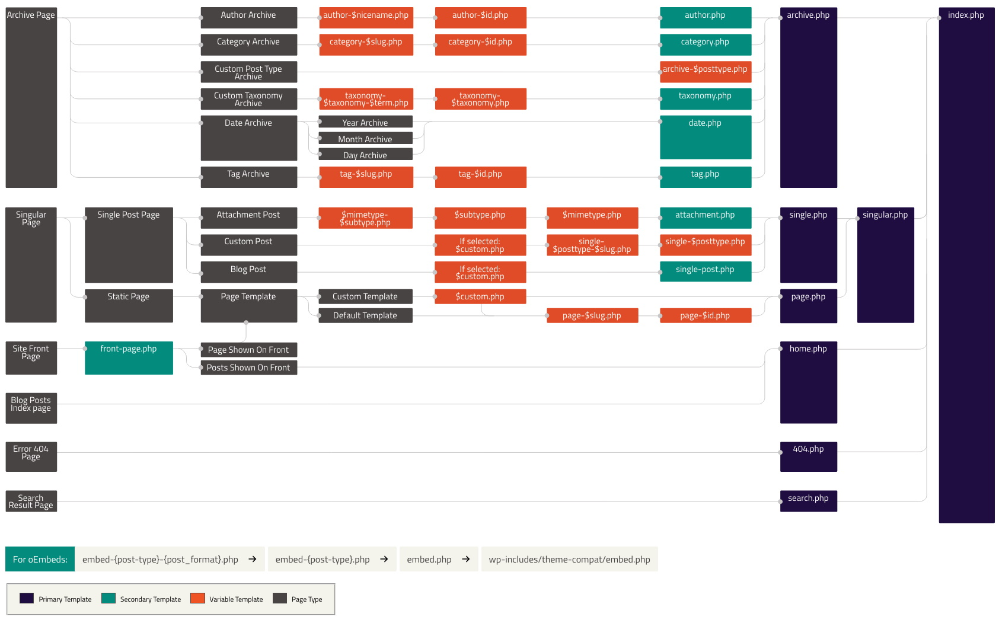

# WordPress

## Requirements

```bash
sudo apt install apache2
sudo systemctl enable apache2
sudo a2enmod rewrite
sudo systemctl status apache2
```

```bash
sudo apt install -y php php-{bcmath,common,mysql,xml,xmlrpc,curl,gd,imagick,cli,dev,imap,mbstring,opcache,soap,zip,intl}
sudo php -v
```

```bash
sudo apt install mariadb-server mariadb-client
sudo systemctl enable --now mariadb
sudo systemctl status mariadb
```

```bash
sudo mysql_secure_installation

Enter current password for root (enter for none): Press ENTER
Set root password? [Y/n]: Y
New password: Set-your-new-password
Re-enter new password: Set-your-new-password
Remove anonymous users? [Y/n] Y
Disallow root login remotely? [Y/n] Y
Remove test database and access to it? [Y/n] Y
Reload privilege tables now? [Y/n] Y
```

```bash
sudo mysql -u root -p

CREATE USER 'wp_user'@'localhost' IDENTIFIED BY 'your_password';
CREATE DATABASE wordpress;
GRANT ALL PRIVILEGES ON wordpress.* TO 'wp_user'@'localhost';
FLUSH PRIVILEGES;
EXIT;
```

## Installation & Configuration

```bash
sudo apt install wget unzip
```

```bash
sudo wget https://wordpress.org/latest.zip
sudo unzip latest.zip
sudo mv wordpress/ /var/www/html/
sudo rm latest.zip
sudo rm /var/www/html/index.html
```

```bash
sudo chown -R www-data:www-data /var/www/html/wordpress/
sudo find /var/www/html/wordpress/ -type d -exec chmod 750 {} \;
sudo find /var/www/html/wordpress/ -type f -exec chmod 640 {} \;
```

```bash
sudo nano /etc/apache2/sites-available/wordpress.conf
```

```
<VirtualHost *:80>
	ServerAdmin admin@example.com
	DocumentRoot /var/www/html/wordpress
	ServerName example.com
	ServerAlias www.example.com

	<Directory /var/www/html/wordpress/>
		Options FollowSymLinks
		AllowOverride All
		Require all granted
	</Directory>

	ErrorLog ${APACHE_LOG_DIR}/error.log
	CustomLog ${APACHE_LOG_DIR}/access.log combined
</VirtualHost>
```

```bash
sudo a2ensite wordpress.conf
sudo a2dissite 000-default.conf
sudo a2enmod rewrite
sudo systemctl restart apache2
```

```
http://your-server-ip-address
```









## Security

### Folder Accesss

```bash
sudo chown -R www-data:www-data /var/www/html/wordpress/
sudo find /var/www/html/wordpress/ -type d -exec chmod 750 {} \;
sudo find /var/www/html/wordpress/ -type f -exec chmod 640 {} \;
```

### Limit PHP Functions

```bash
php -i | grep allow_url_include
allow_url_include => Off => Off
```

### Modify your PHP.ini

```bash
sudo cp /etc/php/8.1/apache2/php.ini /etc/php/8.1/apache2/php.ini.original
sudo nano /etc/php/8.1/apache2/php.ini
```

```
;;;;;;;;;;;
; EXAMPLE ;
;;;;;;;;;;;

[PHP]

;;;;;;;;;;;;;;;;;;;;
; Language Options ;
;;;;;;;;;;;;;;;;;;;;

engine = On
short_open_tag = Off
precision = 14
output_buffering = Off
zlib.output_compression = Off
implicit_flush = Off
serialize_precision = -1
disable_functions = allow_url_fopen,curl_exec,curl_multi_exec,exec,openlog,parse_ini_filew_source,passthru,phpinfo,popen,proc_open,shell_exec,show_source,syslog,system,highlight_file,fopen_with_path,dbmopen,dbase_open,putenv,chdir,filepro,filepro_rowcount,filepro_retrieve,posix_mkfifo
zend.enable_gc = On
zend.exception_ignore_args = On
zend.exception_string_param_max_len = 0
cgi.force_redirect= On

;;;;;;;;;;;;;;;;;
; Miscellaneous ;
;;;;;;;;;;;;;;;;;

expose_php = Off
allow_webdav_methods = Off

;;;;;;;;;;;;;;;;;;;
; Resource Limits ;
;;;;;;;;;;;;;;;;;;;

max_execution_time = 30
max_input_time = 60
memory_limit = 128M

;;;;;;;;;;;;;;;;;;;;;;;;;;;;;;
; Error handling and logging ;
;;;;;;;;;;;;;;;;;;;;;;;;;;;;;;

error_reporting = E_ALL
display_errors = Off
display_startup_errors = Off
log_errors = On
error_log = /var/log/apache2/php_scripts_error.log
ignore_repeated_errors = Off
ignore_repeated_source = Off
report_memleaks = On
track_errors = Off
html_errors = Off

;;;;;;;;;;;;;;;;;
; Data Handling ;
;;;;;;;;;;;;;;;;;

variables_order = "GPCS"
request_order = "GP"
register_argc_argv = Off
auto_globals_jit = On
post_max_size = 25M
auto_prepend_file =
auto_append_file =
default_mimetype = "text/html"
default_charset = "UTF-8"

;;;;;;;;;;;;;;;;;;;;;;;;;
; Paths and Directories ;
;;;;;;;;;;;;;;;;;;;;;;;;;

enable_dl = Off
file_uploads = On
upload_max_filesize = 25M
max_file_uploads = 5

;;;;;;;;;;;;;;;;;;
; Fopen wrappers ;
;;;;;;;;;;;;;;;;;;

allow_url_fopen = Off
allow_url_include = Off
default_socket_timeout = 60

;;;;;;;;;;;;;;;;;;;
; Module Settings ;
;;;;;;;;;;;;;;;;;;;

[CLI Server]
cli_server.color = On

[Date]
date.timezone = Europe/Berlin

[mail function]
SMTP = localhost
smtp_port = 25
mail.add_x_header = Off

[ODBC]
odbc.allow_persistent = On
odbc.check_persistent = On
odbc.max_persistent = -1
odbc.max_links = -1
odbc.defaultlrl = 4096
odbc.defaultbinmode = 1

[MySQLi]
mysqli.max_persistent = -1
mysqli.allow_persistent = On
mysqli.max_links = -1
mysqli.default_port = 3306
mysqli.reconnect = Off

[mysqlnd]
mysqlnd.collect_statistics = On
mysqlnd.collect_memory_statistics = Off

[PostgreSQL]
pgsql.allow_persistent = On
pgsql.auto_reset_persistent = Off
pgsql.max_persistent = -1
pgsql.max_links = -1
pgsql.ignore_notice = 0
pgsql.log_notice = 0

[bcmath]
bcmath.scale = 0

[Session]
session.save_handler = files
session.use_strict_mode = 1
session.use_cookies = 1
session.use_only_cookies = 1
session.name = NEW_SSID
session.auto_start = 0
session.cookie_lifetime = 0
session.cookie_secure = 1
session.cookie_httponly = 1
session.cookie_samesite = Strict
session.serialize_handler = php
session.gc_probability = 0
session.gc_divisor = 1000
session.gc_maxlifetime  = 600
session.cache_limiter = nocache
session.cache_expire = 30
session.use_trans_sid = 0
session.sid_length = 256
session.trans_sid_tags = "a=href,area=href,frame=src,form="
session.sid_bits_per_character = 6

[Assertion]
zend.assertions = -1

[Tidy]
tidy.clean_output = Off

[soap]
soap.wsdl_cache_enabled = 1
soap.wsdl_cache_dir = "/tmp"
soap.wsdl_cache_ttl = 86400
soap.wsdl_cache_limit = 5

[ldap]
ldap.max_links = -1
```

### Block Userlist in WP’s REST API

```
A list all of all is available at users https://example.com/wp-json/wp/v2/users and one can also get information about a specific user at https://example.com/wp-json/wp/v2/users/1, where 1 is a user’s ID. To disable these add this code snippet to your theme’s functions.php file.
```

```php
/* ******************* */
/* Block WP-JSON-Users */
/* ******************* */

add_filter('rest_endpoints', function ($endpoints) {
    if (isset($endpoints['/wp/v2/users'])) {
        unset($endpoints['/wp/v2/users']);
    }
    if (isset($endpoints['/wp/v2/users/(?P<id>[\d]+)'])) {
        unset($endpoints['/wp/v2/users/(?P<id>[\d]+)']);
    }
    return $endpoints;
});
```

### Remove WP-Admin Login-Path

```
Are you looking for a simple, yet effective way to protect your admin page? If so, you can use the WPS Hide Login plugin to change the location of the login page.
The most popular method to break into a website is brute force (continually entering login information until it is right).
Redirect the the login page to another URL with the WPS Hide Login Plugin.
```

## Backup

### Manually

#### Files

```bash
sudo systemctl enable cron
sudo crontab -e
```

```
# Every Monday on 02:00 AM
0 2 * * 1   tar -cvf backup_wordpress_$(date "+%d-%b-%y").tar /var/www/html/wordpress
```

#### Database

```bash
sudo systemctl enable cron
sudo crontab -e
```

```
# Every Monday on 02:00 AM
0 2 * * 1   mysqldump -u [USERNAME] -p [DATABASE] > backup_wordpress_$(date "+%d-%b-%y").sql
```

### via Plugin

- #### [UpdraftPlus](https://de.wordpress.org/plugins/updraftplus/)
- #### [BackWPup](https://de.wordpress.org/plugins/backwpup/)
- #### [VaultPress](https://de.wordpress.org/plugins/vaultpress/)

### Export Data (no Backup!)



## Plugins

- [WPS Hide Login](https://de.wordpress.org/plugins/wps-hide-login/)
- [wp_head() cleaner](https://de.wordpress.org/plugins/wp-head-cleaner/)
- [WP Fastest Cache](https://de.wordpress.org/plugins/wp-fastest-cache/)
- [Very Simple Meta Description](https://wordpress.org/plugins/very-simple-meta-description/)
- [Real Media Library](https://de.wordpress.org/plugins/real-media-library-lite/)
- [Polylang](https://de.wordpress.org/plugins/polylang/)
- [Insert PHP Code Snippet](https://de.wordpress.org/plugins/insert-php-code-snippet/)
- [Nested Pages](https://de.wordpress.org/plugins/wp-nested-pages/)
- [Health Check & Troubleshooting](https://wordpress.org/plugins/health-check/)

## Classic Theme [^1] [^2]

### Folder Structure Example



```
theme
├── css
│	└── custom.css
├── js
│	└── script.js
├── img
│	├── img/favicon.ico
│	└── img/logo.png
├── functions.php			// WordPress-Functions
├── screenshot.png			// Default-Screenshot
├── style.css				// Default-Stylesheet and Theme Information
├── header.php				// Header Template-Part
├── nav.php					// Navigation Template-Part
├── main.php				// Content Template-Part
├── sidebar.php				// Sidebar Template-Part
├── footer.php				// Footer Template-Part
├── searchform.php			// Search-Form Template-Part
├── comments.php			// Comments Template-Part
├── index.php				// Blog Page-Template
├── 404.php					// 404 Page-Template
├── front-page.php			// Home Page-Template
├── page.php				// Site Page-Template
├── single.php				// Blog-Entry Page-Template
└── search.php				// Search-Result Page-Template
```

### Shortcodes

#### functions.php

```php
<?php

/* ********************* */
/* Register Custom Theme */
/* ********************* */

if (!function_exists('my_theme_setup')) :
    function my_theme_setup()
    {
        /* Make theme available for translation. Translations can be placed in the /languages/ directory. */
        load_theme_textdomain('myfirsttheme', get_template_directory() . '/languages');

        /* Add default posts and comments RSS feed links */
        add_theme_support('automatic-feed-links');

        /* Enable support for post thumbnails and featured images. */
        add_theme_support('post-thumbnails');

        /* Enable support for the following post formats: aside, gallery, quote, image, and video */
        add_theme_support('post-formats', array('aside', 'gallery', 'quote', 'image', 'video'));
    }
endif;

add_action('after_setup_theme', 'my_theme_setup');

/* ********************* */
/* Register Custom Menus */
/* ********************* */

function insert_main_menu()
{
    register_nav_menu('REGISTER-NAME', __('main-menu'));
}

add_action('init', 'insert_main_menu');

/* *********** */
/* Breadcrumbs */
/* *********** */

function insert_breadcrumbs()
{
    echo '<div class="breadcrumbs">';
    echo '<a href="' . home_url() . '" rel="nofollow">Home</a>';

    if (is_category() || is_single()) {
        echo '&nbsp;&nbsp;&#187;&nbsp;&nbsp;';
        the_category(' &bull; ');

        if (is_single()) {
            echo '&nbsp;&nbsp;&#187;&nbsp;&nbsp;';
            the_title();
        }
    } elseif (is_page()) {
        echo '&nbsp;&nbsp;&#187;&nbsp;&nbsp;';
        echo the_title();
    } elseif (is_search()) {
        echo '&nbsp;&nbsp;&#187;&nbsp;&nbsp;Search Results for... ';
        echo '"<em>';
        echo the_search_query();
        echo '</em>"';
    }

    echo '</div>';
}

/* *********** */
/* Random Page */
/* *********** */

function insert_random_link()
{
    $pages = get_pages();
    $randomKey = (mt_rand(1, count($pages)) - 1);
    $page = $pages[$randomKey];
    $pageLink = get_page_link($page->ID);
    echo '<a href="' . $pageLink . '">Random Page</a>';
}

/* ******************** */
/* SEO Meta-Description */
/* ******************** */

function insert_meta_description()
{
    $post_id = get_the_ID();
    $post = get_post($post_id);
    setup_postdata($post);
    $excerpt = esc_attr(strip_tags(get_the_excerpt()));
    echo $excerpt;
    wp_reset_postdata();
}

/* *********** */
/* Page Author */
/* *********** */

function insert_author()
{
    if (have_posts()) : while (have_posts()) : the_post();
            echo get_the_author();
        endwhile;
    endif;
}

/* ************************* */
/* Blog-Post with Navigation */
/* ************************* */

function insert_blog_pagination($pages, $range)
{
    $showitems = ($range * 2) + 1;

    global $paged;
    if (empty($paged)) $paged = 1;

    if ($pages == '') {
        global $wp_query;
        $pages = $wp_query->max_num_pages;
        if (!$pages) {
            $pages = 1;
        }
    }

    if (1 != $pages) {
        echo '<div class="post-pagination-wrapper">';
        echo '<span class="post-pagination">&#187;';

        for ($i = 1; $i <= $pages; $i++) {
            if (1 != $pages && (!($i >= $paged + $range + 1 || $i <= $paged - $range - 1) || $pages <= $showitems)) {
                echo ($paged == $i) ? '<span>' . $i . '</span>' : '<a href="' . get_pagenum_link($i) . '">' . $i . '</a>';
            }
        }

        echo '&#171;</span>';
        echo '<small>Page ' . $paged . ' of ' . $pages . '</small>';
        echo '</div>';
    }
}

/* ************************* */
/* Excerpt Length of Words */
/* ************************* */

function my_excerpt_length($length)
{
    return 15;
}

add_filter('excerpt_length', 'my_excerpt_length');

/* ******************* */
/* Block WP-JSON-Users */
/* ******************* */

add_filter('rest_endpoints', function ($endpoints) {
    if (isset($endpoints['/wp/v2/users'])) {
        unset($endpoints['/wp/v2/users']);
    }
    if (isset($endpoints['/wp/v2/users/(?P<id>[\d]+)'])) {
        unset($endpoints['/wp/v2/users/(?P<id>[\d]+)']);
    }
    return $endpoints;
});
```

#### head

```php
<!-- Website-Language -->
<?php language_attributes(); ?>

<!-- Website-Charset -->
<?php bloginfo('charset'); ?>

<!-- Path to Template-Folder -->
<?php echo get_bloginfo( 'template_directory' );?>

<!-- Page Author -->
<?php insert_author(); ?>

<!-- Page Title -->
<?php the_title(); ?>

<!-- Page Description -->
<?php insert_meta_description(); ?>

<!-- WordPress-Specific-Elements -->
<?php wp_head(); ?>
```

#### body

```php
<!-- WordPress-Specific-Elements -->
<?php wp_footer(); ?>
```

#### header

```php
<!-- Website-Name -->
<?php bloginfo('name'); ?>

<!-- Website-Description -->
<?php bloginfo('description'); ?>

<!-- Website-URL -->
<?php echo home_url(); ?>
```

#### nav

```php
<!-- Main-Menu -->
<?php wp_nav_menu(array('theme_location' => 'REGISTER-NAME', 'container_class' => 'main-menu')); ?>
```

#### sidebar

```php
<!-- Breadcrumb-Navigation -->
<?php insert_breadcrumbs(); ?>

<!-- Import Search-Form -->
<?php get_search_form(); ?>
```

#### footer

```php
<!-- List of all Post-Categories -->
<?php wp_list_categories('orderby=name&order=ASC&title_li='); ?>

<!-- List the monthly Archive -->
<?php wp_get_archives('type=monthly'); ?>

<!-- List all Pages -->
<?php wp_list_pages('title_li=' . __('')); ?>

<!-- Link to Random Page -->
<?php insert_random_link(); ?>
```

#### search

```php
<!-- Search-Results -->
<?php if (have_posts()) : ?>
  <!-- Print Search-Term -->
  <?php echo $s ?>
  <!-- Loop prints all Sites and Post including the Search-Term -->
  <?php $i = 1;
  while (have_posts()) : the_post(); ?>
    <!-- Title of Site or Post -->
    <?php the_title(); ?>
    <!-- Trimmed (20) Content of Site or Post and Link -->
    <?php echo wp_trim_words(get_the_content(), 20); ?> <a href="<?php the_permalink(); ?>">read more</a>
  <?php $i++;
  endwhile; ?>
<?php else : ?>
  <!-- If no match found -->
  <?php echo "Sorry, nothing found matching your search criteria!" ?>
<?php endif; ?>
```

#### searchform

```php
<!-- Search-Form-Template -->
<form class="search-menu" method="get" action="<?php echo esc_url(home_url('/')); ?>">
  <input type="text" placeholder="What you looking for ?" name="s" value="<?php echo get_search_query(); ?>">
  <button type="submit">Search</button>
</form>
```

#### index

```php
<!-- Show Posts with Pagination -->
<?php if (get_query_var('paged')) {
    $paged = get_query_var('paged');
} elseif (get_query_var('page')) {
    $paged = get_query_var('page');
} else {
    $paged = 1;
} ?>

<!-- Show defined public Posts -->
<?php query_posts(array(
    'post_type' => 'post',
    'paged' => $paged,
    'posts_per_page' => 4,
    'post_status' => 'publish'
)); ?>

<!-- Loop through every Post -->
<?php if (have_posts()) : ?>
    <?php while (have_posts()) : the_post(); ?>
      <!-- Post-Thumbnail -->
      <?php if (has_post_thumbnail()) {
            get_the_post_thumbnail(get_the_ID(), "thumbnail");
        } else {
            echo '';
        } ?>
      <!-- Post-Title -->
      <?php the_title(); ?>
      <!-- Post-Content (10 words) -->
      <?php the_excerpt(); ?
      <!-- Post-Link -->
      <?php the_permalink(); ?>
    <?php endwhile; ?>
</div>
<?php endif; ?>

<!-- Pagination for Posts -->
<?php if (function_exists("insert_blog_pagination")) : ?>
<?php insert_blog_pagination("", 4); ?>
<?php endif; ?>
<?php wp_reset_query(); ?>
```

#### page

```php
<!-- If Content exists then post -->
<?php if (have_posts()) : while (have_posts()) : the_post(); ?>
    <!-- Page-Title -->
    <?php the_title(); ?>
    <!-- Page-Content -->
    <?php the_content(); ?>
    <!-- Page-Last-Update -->
    <?php the_modified_date() ?>
<?php endwhile;
endif; ?>
```

#### single

```php
<!-- If Content exists then post -->
<?php if (have_posts()) : while (have_posts()) : the_post(); ?>
  <!-- Post-Title -->
  <?php the_title(); ?>
  <!-- Post-Content -->
  <?php the_content(); ?>
  <!-- Post-Last-Update -->
  <?php the_modified_date() ?>
  <!-- Post-Category -->
  <?php the_category(', ');
<?php endwhile;
endif; ?>

<!-- Includes comments.php -->
<?php comments_template(); ?>
```

#### comments

```php
<!-- Block comments.php from direct calling -->
<?php
  if (!empty($_SERVER['SCRIPT_FILENAME']) && 'comments.php' == basename($_SERVER['SCRIPT_FILENAME'])) :
  die('The "comments.php" file cannot be called directly.');
  endif;
?>

<!-- Loop prints all Comments to this Post-ID -->
<?php foreach ($comments as $comment) : ?>
  <!-- Comment-Template -->
  <div class="comment-tag" id="comment-<?php comment_ID(); ?>">
    <!-- Comment-Author-Name -->
    <?php comment_author_link() ?>
    <!-- Comment-Date -->
    <?php comment_date('j. F Y') ?>
    <!-- Comment-Time -->
    <?php comment_time('H:i') ?>
    <!-- Comment-Text -->
    <?php comment_text() ?>
  </div>
<?php endforeach; ?>

<!-- Comment-Form-Template -->
<form class="comment-form" action="<?php echo get_option('siteurl'); ?>/wp-comments-post.php" method="post">
  <!-- Comment-Author-Name -->
  <label for="author">Author</label>
  <input type="text" name="author" id="author" value="<?php echo $comment_author; ?>" size="20" tabindex="1">
  <!-- Comment-Author-EMail -->
  <label for="email">E-Mail</label>
  <input type="text" name="email" id="email" value="<?php echo $comment_author_email; ?>" size="20" tabindex="2">
  <!-- Comment-Author-URL -->
  <label for="url">URL</label>
  <input type="text" name="url" id="url" value="<?php echo $comment_author_url; ?>" size="20" tabindex="3">
  <!-- Comment-Text -->
  <label for="comment">Comment</label>
  <textarea name="comment" id="comment" rows="10" tabindex="4"></textarea>
  <input name="submit" type="submit" id="submit" value="Post" tabindex="5">
  <input type="hidden" name="comment_post_ID" value="<?php echo $id; ?>">
  <?php do_action('comment_form', $post->ID); ?>
</form>
```
