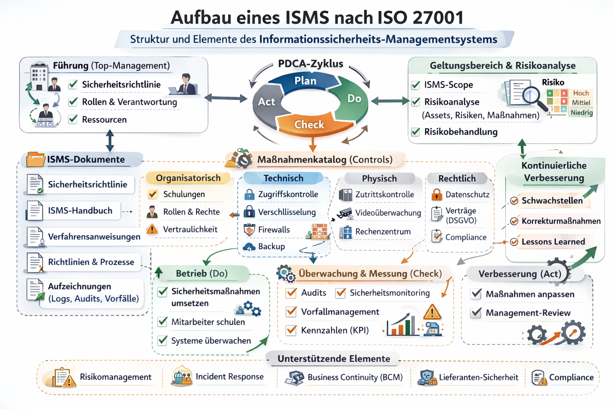

# ISMS

Ein ISMS (Information Security Management System) nach ISO 27001 ist ein strukturiertes Rahmenwerk, das Unternehmen dabei unterstützt, Informationen systematisch zu schützen. Es umfasst Richtlinien, Prozesse, Kontrollen und kontinuierliche Verbesserungen. Hier ist eine Übersicht in Textform, wie ein ISMS typischerweise aufgebaut ist:

## 1. Kontext und Geltungsbereich

- Definition, welche Bereiche, Abteilungen oder Systeme abgedeckt werden.
- Verständnis der Anforderungen von Stakeholdern (Kunden, Partner, Gesetzgeber).
- Festlegung der Informationswerte, die geschützt werden müssen.

- IRP-Bezug: Festlegung, welche Systeme, Abteilungen und Informationen vom Incident Response Plan abgedeckt werden.
- Beispiel: Der Plan gilt für Server, Cloud-Dienste und Mitarbeiterendgeräte, die Kundendaten enthalten.

## 2. Leitung & Verantwortlichkeiten

- Management unterstützt aktiv die Informationssicherheit.
- Festlegung von Verantwortlichkeiten und Rollen für Sicherheit.

- IRP-Bezug: Benennung der Rollen und Verantwortlichen für Sicherheitsvorfälle.
- Beispiel: CISO, IT-Security-Team, Abteilungsleiter und Kommunikationsverantwortliche werden klar definiert.

## 3. Risikomanagement

- Identifikation von Risiken für Informationssicherheit.
- Bewertung der Risiken nach Eintrittswahrscheinlichkeit und Auswirkung.
- Maßnahmen zur Risikobehandlung (vermeiden, reduzieren, akzeptieren, übertragen).

- IRP-Bezug: Berücksichtigung von Risiken, die zu Vorfällen führen könnten, und deren Auswirkungen auf den IRP.
- Beispiel: Ransomware-Risiko → Szenarien im Plan inkl. Isolation betroffener Systeme.

## 4. Sicherheitskontrollen / Maßnahmen

- Basierend auf ISO 27001 Annex A: z. B.
    - Zugangskontrolle & Identitätsmanagement
    - Verschlüsselung von Daten
    - Backup- und Recovery-Prozesse
    - Physische Sicherheit (Serverräume)
    - Sicherheit von Netzwerken und Endgeräten

- IRP-Bezug: Technische Maßnahmen, die im Plan beschrieben sind, wie z. B. Isolation von Servern, Aktivierung von Firewalls oder Wiederherstellung von Backups.
- Beispiel: Automatische Trennung eines kompromittierten Netzwerkteils laut Plan.

## 5. Schulungen & Bewusstsein

- Alle Mitarbeitenden werden regelmäßig in Sicherheitsrichtlinien und Bedrohungen geschult.
- Sensibilisierung für Social Engineering und Phishing.

- IRP-Bezug: Mitarbeiterschulungen zur Anwendung des IRP.
- Beispiel: Simulation von Phishing-Angriffen, bei denen Mitarbeitende den IRP testen und melden.

## 6. Vorfallmanagement

- Prozesse für das Erkennen, Melden, Behandeln und Analysieren von Sicherheitsvorfällen.
- Dokumentation und Lessons Learned für zukünftige Prävention.

- IRP-Bezug: Kern des Abschnitts – der Incident Response Plan beschreibt die Schritte bei jedem Sicherheitsvorfall:
    - Erkennen / Melden
    - Analyse / Eindämmung
    - Kommunikation intern / extern
    - Wiederherstellung und Lessons Learned

## 7. Überwachung & Audit

- Regelmäßige interne Audits zur Kontrolle der Effektivität des ISMS.
- Überwachung von KPIs wie Anzahl der Sicherheitsvorfälle, Patch-Level oder Mitarbeiterschulungen.
- Incident Response Plan

- IRP-Bezug: Nachbearbeitung von Vorfällen:
    - Wurden die Schritte korrekt durchgeführt?
    - Dokumentation der Wirksamkeit des Plans
    - Ableitung von Verbesserungen

## 8. Kontinuierliche Verbesserung (PDCA-Zyklus)

- Plan: Sicherheitsrisiken identifizieren und Maßnahmen planen
- Do: Maßnahmen implementieren
- Check: Wirksamkeit überprüfen, Audits durchführen
- Act: Verbesserungen umsetzen

- IRP-Bezug: Lessons Learned aus Vorfällen fließen in den IRP zurück.
- Beispiel: Nach einem Phishing-Vorfall werden Prozesse angepasst, Schulungen ergänzt und Alarmmechanismen optimiert.

## Zusammenfassung

Ein ISMS nach ISO 27001 ist kein einmaliges Projekt, sondern ein kontinuierlicher Prozess, der:
- Risiken systematisch identifiziert und reduziert
- Richtlinien, Kontrollen und Prozesse implementiert
- Mitarbeitende einbindet und schult
- Sicherheitsvorfälle effizient behandelt
- Regelmäßig überprüft und verbessert wird