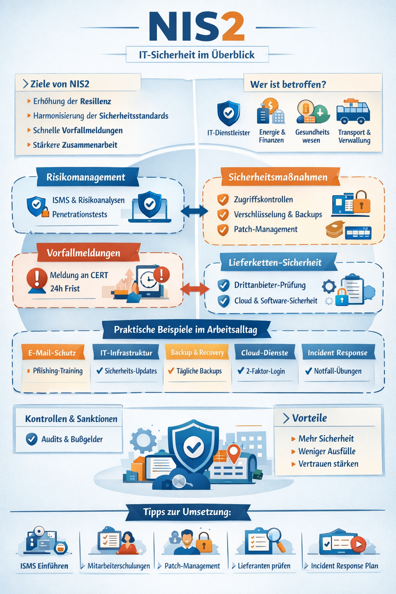

# NIS2

## 1. Einführung in NIS2

Die NIS2-Richtlinie (Network and Information Security 2) ist die Weiterentwicklung der ersten NIS-Richtlinie der EU. Sie zielt darauf ab, die Cybersicherheit in kritischen Sektoren zu verbessern und einen einheitlichen Sicherheitsstandard in der EU zu etablieren.

Wichtige Eckpunkte:
- Inkrafttreten: Januar 2023 (EU-weite Umsetzung bis 2025)
- Ziel: Schutz kritischer Infrastrukturen vor Cyberangriffen
- Geltungsbereich: Energie, Transport, Gesundheitswesen, digitale Dienste, öffentliche Verwaltung, IT-Dienstleister, Finanzsektor
- Verpflichtet Unternehmen zu Sicherheitsmaßnahmen, Risikomanagement und Meldung von Vorfällen

## 2. Ziele von NIS2

- Erhöhung der Resilienz: Unternehmen müssen Cyberrisiken besser erkennen und abwehren.
- Harmonisierung der IT-Sicherheitsstandards innerhalb der EU.
- Verbesserung der Zusammenarbeit zwischen Mitgliedsstaaten bei Sicherheitsvorfällen.
- Schnelle Meldung von Sicherheitsvorfällen an nationale Behörden.

## 3. Wichtige Anforderungen an Unternehmen

NIS2 unterscheidet zwischen wesentlichen und wichtigen Einrichtungen, die unterschiedliche Pflichten haben.

### 3.1 Risikomanagement

- Einführung eines IT-Sicherheitsmanagementsystems (ISMS)
- Regelmäßige Risikobewertungen
- Schutzmaßnahmen für:
    - Netzwerke
    - Informationssysteme
    - Cloud-Dienste

Praxisbeispiel:
- Ein mittelständisches Softwareunternehmen führt monatlich Penetrationstests und eine Inventarisierung aller Server durch, um Schwachstellen frühzeitig zu erkennen.

### 3.2 Sicherheitsmaßnahmen

- Zugriffskontrollen (Identity & Access Management)
- Verschlüsselung sensibler Daten
- Backup- und Recovery-Pläne
- Sicherheitsupdates & Patch-Management

Praxisbeispiel:
- Ein Krankenhaus stellt sicher, dass Patientendaten verschlüsselt übertragen werden, regelmäßig Updates eingespielt werden und Mitarbeiter Zwei-Faktor-Authentifizierung nutzen.

### 3.3 Meldung von Sicherheitsvorfällen

- Meldung innerhalb von 24 Stunden bei schwerwiegenden Vorfällen
- Zusammenarbeit mit nationalen Computer Emergency Response Teams (CERTs)

Praxisbeispiel:
- Ein IT-Dienstleister entdeckt Ransomware auf einem Kundensystem und meldet den Vorfall innerhalb eines Tages an das nationale CERT.

### 3.4 Lieferketten-Sicherheit

- Analyse von Drittanbietern und Partnern
- Anforderungen an Cloud-Provider, Softwarehersteller und externe Dienstleister

Praxisbeispiel:
- Ein Finanzunternehmen prüft alle Software-Lieferanten auf Sicherheitsstandards, bevor neue Anwendungen in Produktion gehen.

## 4. Umsetzung im Arbeitsalltag

| Bereich | Praktisches Beispiel |
| :--- | :--- |
| E-Mail-Sicherheit | Mitarbeiter erhalten Schulungen zum Erkennen von Phishing-Mails, eingehende E-Mails werden durch eine Security Gateway gefiltert |
| IT-Infrastruktur | Regelmäßige Updates von Betriebssystemen und Datenbanken, Netzwerksegmentierung zur Isolation kritischer Systeme |
| Backup & Recovery | Tägliche Backups in verschlüsselten Cloud-Speichern, regelmäßige Wiederherstellungstests |
| Cloud-Dienste | Multi-Faktor-Authentifizierung, SLA mit Sicherheitsklauseln für Cloud-Provider |
| Incident Response | Einrichtung eines Notfallplans mit klaren Verantwortlichkeiten, Durchführung von jährlichen Simulationen von Cyberangriffen |

## 5. Kontrolle und Sanktionen

- Nationale Behörden führen Audits durch
- Bußgelder können bis zu 10 Mio. € oder 2 % des Jahresumsatzes betragen
- Unternehmen müssen Compliance nachweisen

Praxisbeispiel:
- Ein Energieversorger wird geprüft, ob er NIS2-konforme IT-Sicherheitsrichtlinien und Vorfallberichte nachweisen kann.

## 6. Vorteile für Unternehmen

- Schutz vor Cyberangriffen → weniger Ausfallzeiten
- Vertrauen bei Kunden und Partnern
- Klare Vorgaben für die IT-Sicherheitsstrategie
- Einheitliche Standards in der EU erleichtern grenzüberschreitende Kooperation

## 7. Praktische Umsetzungstipps

- ISMS einführen – z.B. nach ISO 27001
- Mitarbeiterschulungen regelmäßig durchführen
- Patch-Management automatisieren
- Incident Response Plan testen und dokumentieren
- Lieferanten prüfen und Verträge mit Sicherheitsanforderungen gestalten
- Regelmäßig Audits durchführen und Verbesserungspotenziale umsetzen

## 8. Fazit

NIS2 ist nicht nur gesetzliche Pflicht, sondern ein Wegweiser für IT-Sicherheitspraktiken. Unternehmen, die die Richtlinie ernst nehmen, profitieren von resilienteren IT-Systemen, verlässlicheren Geschäftsprozessen und höherem Vertrauen von Kunden und Partnern.