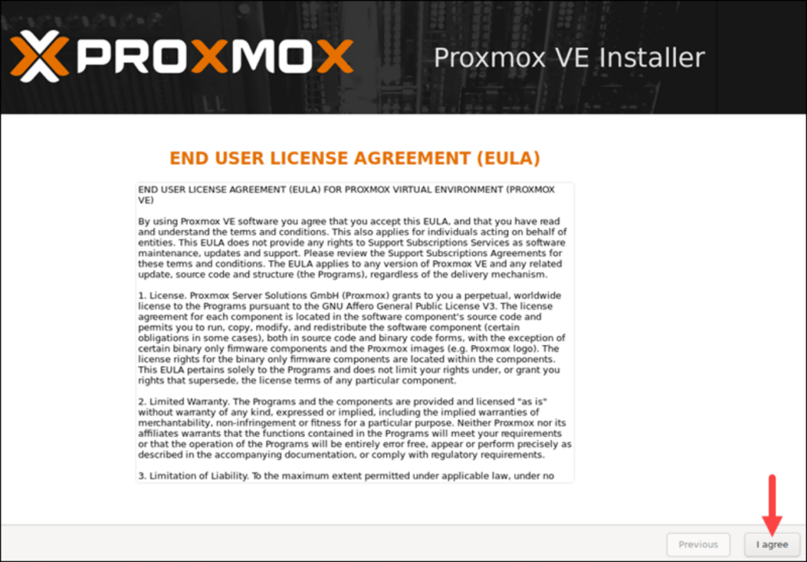
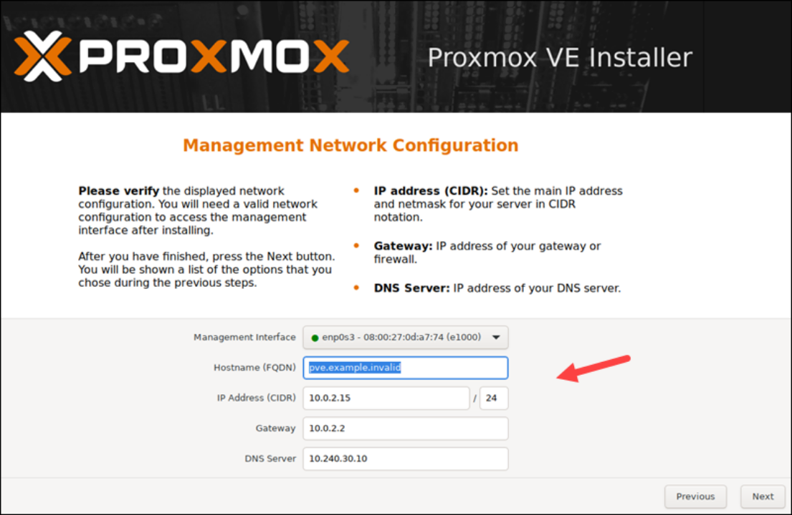

# Proxmox

## Hardware Requirements

- Intel EMT64 or AMD64 with Intel VT/AMD-V CPU flag.
- Memory, minimum 2 GB for OS and Proxmox VE services. Plus designated memory for guests. For Ceph or ZFS additional memory is required, approximately 1 GB memory for every TB used storage.
- Fast and redundant storage, best results with SSD disks.
- OS storage: Hardware RAID with batteries protected write cache (“BBU”) or non-RAID with ZFS and SSD cache.
- VM storage: For local storage use a hardware RAID with battery backed write cache (BBU) or non-RAID for ZFS. Neither ZFS nor Ceph are compatible with a hardware RAID controller. Shared and distributed storage is also possible.
- Redundant Gbit NICs, additional NICs depending on the preferred storage technology and cluster setup – 10 Gbit and higher is also supported.
- For PCI(e) passthrough a CPU with VT-d/AMD-d CPU flag is needed.

## Installation

1. The Proxmox VE menu appears. Select Install Proxmox VE to start the standard installation.


2. Read and accept the EULA to continue.



3. Choose the target hard disk where you want to install Proxmox. Click Options to specify additional parameters, such as the filesystem. By default, it is set to ext4.


4. Next, set the location, time zone, and keyboard layout. The installer autodetects most of these configurations.


5. Create a strong password for your admin credentials, retype the password to confirm, and type in an email address for system administrator notifications.


6. The final step in installing Proxmox is setting up the network configuration. Select the management interface, a hostname for the server, an available IP address, the default gateway, and a DNS server. During the installation process, use either an IPv4 or IPv6 address. To use both, modify the configuration after installing.



7. The installer summarizes the selected options. After confirming everything is in order, press Install.

> **Note:**
> http://your-server-ip-address

## Create Network Bridge


## Create a VM

1. Click the Create VM button.


2. Provide general information about the VM:

- Start by selecting the Node. If you are starting and have no nodes yet, Proxmox automatically selects node 1 (pve1).
- Provide a VM ID. Each resource has to have a unique ID.
- Finally, specify a name for the VM.


3. Next, switch to the OS tab and select the ISO image you want for your VM. Define the OS Type and kernel Version. Click Next to continue.


4. Modify system options (such as the Graphic card and SCSI controller) or leave the default settings.


5. Configure any Hard Disk options you want the VM to have. You can leave all the default settings. However, if the physical server uses an SSD, enable the Discard option.


6. The number of Cores the physical server has determines how many cores you can provide to the VM. The number of cores allocated also depends on the predicted workload.


7. Next, choose how much RAM Memory (MiB) you want to assign to the VM.


8. Move on to the Network tab. It is recommended to separate the management interface from the VM network. For now, leave the default setting and click Next.


9. Proxmox loads the Confirm tab that summarizes the selected VM options. To start the VM immediately, check the box under the listed information or start the VM manually later. Click Finish to create the VM.


10. The newly created VM appears in the resource tree on the left side of the screen. Click the VM to see its specifications and options.

## Security [^3]

### Differences between repositories [^1] [^2]

A Proxmox server gets its updates from a repository. The two relevant repositories are pve-enterprise and pve-no-subscription.

When new updates are released, these updates are first tested internally at Proxmox and some external developers according to the release plan. If no major errors occur, the updates are placed in the pve-no-subscription repository. pve-no-subscription is free and can be used on any server.

After a few weeks and installation on thousands of systems without any anomalies or errors, the updates are then added to the enterprise repository. Therefore, the updates in Enterprise are delayed by a few weeks, but are already in use on many systems.

However, with the Enterprise Subscription you get: Support directly from the manufacturer (from Basic), remote support via SSH (from Standard) and are a sensible investment for the operation of important VMs.

1. Remove Enterprise Repository via Shell

```bash
rm /etc/apt/sources.list.d/pve-enterprise.list
```

2. Add No Subscription Repository

```bash
nano /etc/apt/sources.list
```

```bash
# main updates
deb http://ftp.debian.org/debian bookworm main contrib
deb http://ftp.debian.org/debian bookworm-updates main contrib

# Proxmox VE pve-no-subscription repository provided by proxmox.com, NOT recommended for production use
deb http://download.proxmox.com/debian/pve bookworm pve-no-subscription

# security updates
deb http://security.debian.org/debian-security bookworm-security main contrib
```

3. Update to the Community Edition

```bash
apt update && apt upgrade -y
```

4. Remove "No Subscription" message

```bash
cd /usr/share/javascript/proxmox-widget-toolkit
cp proxmoxlib.js proxmoxlib.js.bak
nano proxmoxlib.js
```

```bash
#REPLACE
Ext.Msg.show({
title: gettext('No valid subscription'),

#WITH
void({ //Ext.Msg.show({
title: gettext('No valid subscription'),
```

```bash
systemctl restart pveproxy.service
```

### SSH

```bash
cp /etc/ssh/sshd_config /etc/ssh/sshd_config.original
sshd -T
nano /etc/ssh/sshd_config
```

```
Protocol 2
Port 54321
PermitRootLogin yes
PermitEmptyPasswords no
PasswordAuthentication yes
PubkeyAuthentication yes
MaxAuthTries 3
```

```bash
service ssh restart
```

### ACL

```bash
nano /etc/hosts.allow
```

```
sshd : localhost : allow
sshd : 141.89.97.0/24 : allow
sshd : 141.89.100.0/24 : allow
sshd : ALL : deny
```

```bash
nano /etc/hosts.deny
```

### fail2ban

```bash
apt install fail2ban -y
```

```bash
cp /etc/fail2ban/jail.conf /etc/fail2ban/jail.local
nano /etc/fail2ban/jail.local
```

Add these lines to the under named sections

```
[default]
allowipv6 = auto
backend = systemd
```

```
[sshd]
enabled = true
```

Add these lines to the end of the file

```
[proxmox]
enabled = true
port = https,http,8006
filter = proxmox
backend = systemd
maxretry = 3
findtime = 2d
bantime = 1h
```

```bash
nano /etc/fail2ban/filter.d/proxmox.conf
```

```
[Definition]
failregex = pvedaemon\[.*authentication failure; rhost=<HOST> user=.* msg=.*
ignoreregex =
```

```bash
systemctl enable fail2ban
systemctl start fail2ban
systemctl status fail2ban
```

Now incoming login attempts to the Proxmox web interface are monitored by Fail2Ban and potential attackers are blocked for one hour after just 3 invalid login attempts.

### Disable unnecessary protocols

1. Disable Network File System

```bash
nano /etc/default/nfs-common
```

```
NEED_STATD=no
```

2. Disable Remote Procedure Call

```bash
systemctl disable --now rpcbind.service rpcbind.socket
reboot
```

3. Limit Postfix to IPv4

```bash
nano /etc/postfix/main.cf
```

```
inet_protocols = ipv4
```

```bash
service postfix restart
```

4. Kernel parameters as recommended by the BSI

```bash
nano /etc/sysctl.conf
```

```
# Disable forwarding
net.ipv4.ip_forward = 0
net.ipv6.conf.all.forwarding = 0

# Disable packet redirect
net.ipv4.conf.all.send_redirects = 0
net.ipv4.conf.default.send_redirects = 0

# Do not accept routed packets
net.ipv4.conf.all.accept_source_route = 0
net.ipv4.conf.default.accept_source_route = 0
net.ipv6.conf.all.accept_source_route = 0
net.ipv6.conf.default.accept_source_route = 0

# Do not accept ICMP redirects
net.ipv4.conf.all.accept_redirects = 0
net.ipv4.conf.default.accept_redirects = 0
net.ipv6.conf.all.accept_redirects = 0
net.ipv6.conf.default.accept_redirects = 0

# Do not accept secure ICMP redirects
net.ipv4.conf.all.secure_redirects = 0
net.ipv4.conf.default.secure_redirects = 0

# Suspicious packets must be logged
net.ipv4.conf.all.log_martians = 1
net.ipv4.conf.default.log_martians = 1

# Broadcast ICMP requests must be ignored
net.ipv4.icmp_echo_ignore_broadcasts = 1

# Bogus ICMP responses must be ignored
net.ipv4.icmp_ignore_bogus_error_responses = 1

# Enable Reverse Path Filtering
net.ipv4.conf.all.rp_filter = 1
net.ipv4.conf.default.rp_filter = 1

# TCP SYN cookies must be enabled
net.ipv4.tcp_syncookies = 1

# Disable IPv6 Router Advertisements
net.ipv6.conf.all.accept_ra = 0
net.ipv6.conf.default.accept_ra = 0

# Disable IPv6 completely
net.ipv6.conf.all.disable_ipv6 = 1
```

### Firewall

To protect against potentially unprotected services running on other ports, the Proxmox Firewall should be activated.
Make the following configuration in the navigation menu on the left under Datacenter > Firewall > Add:


Then activate the firewall under Datacenter > Firewall > Options by setting Firewall to Yes.
Now all incoming requests that are not directed to SSH or the Proxmox Web UI will be automatically blocked.

[^1]: https://pve.proxmox.com/wiki/Package_Repositories
[^2]: https://johnscs.com/remove-proxmox51-subscription-notice/
[^3]: https://bw-edv.de/blog/de-de/proxmox-ve-anleitung-zur-sicherheitshaertung
