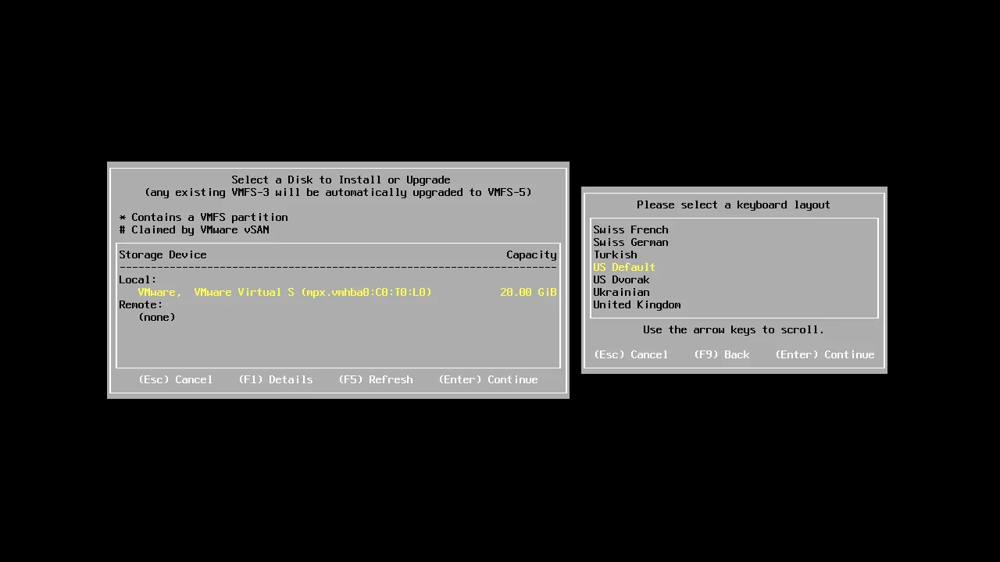
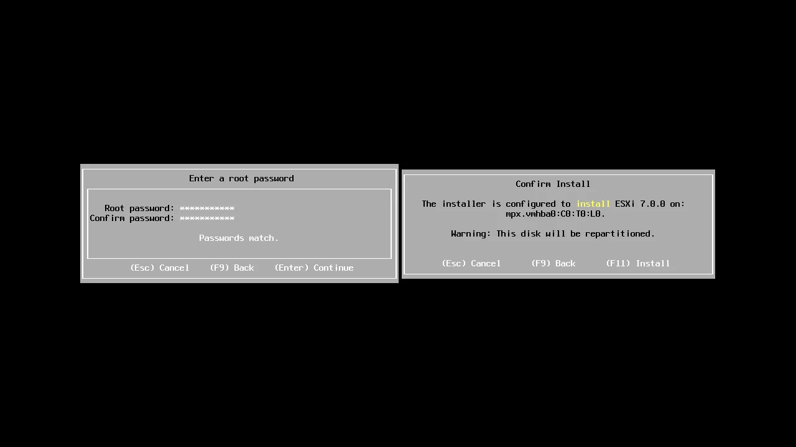
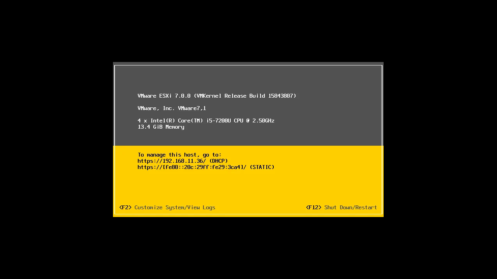
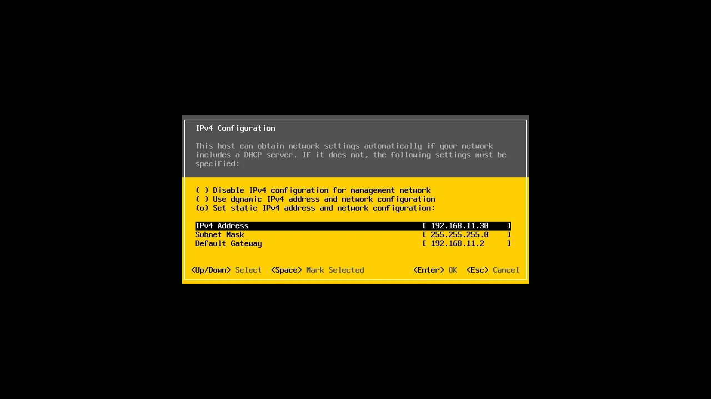
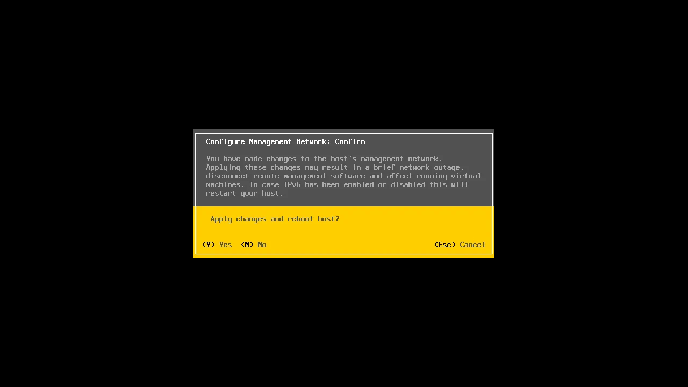

# Proxmox

## Hardware Requirements

- Intel EMT64 or AMD64 with Intel VT/AMD-V CPU flag.
- Memory, minimum 2 GB for OS and Proxmox VE services. Plus designated memory for guests. For Ceph or ZFS additional memory is required, approximately 1 GB memory for every TB used storage.
- Fast and redundant storage, best results with SSD disks.
- OS storage: Hardware RAID with batteries protected write cache (“BBU”) or non-RAID with ZFS and SSD cache.
- VM storage: For local storage use a hardware RAID with battery backed write cache (BBU) or non-RAID for ZFS. Neither ZFS nor Ceph are compatible with a hardware RAID controller. Shared and distributed storage is also possible.
- Redundant Gbit NICs, additional NICs depending on the preferred storage technology and cluster setup – 10 Gbit and higher is also supported.
- For PCI(e) passthrough a CPU with VT-d/AMD-d CPU flag is needed.

## Installation

## Security

## Backup
