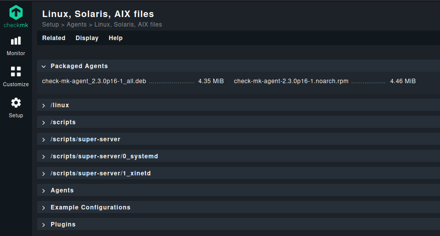
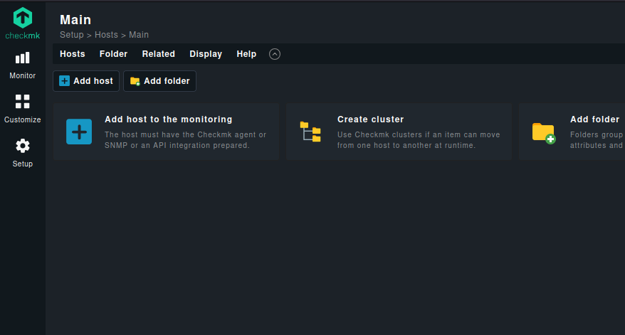
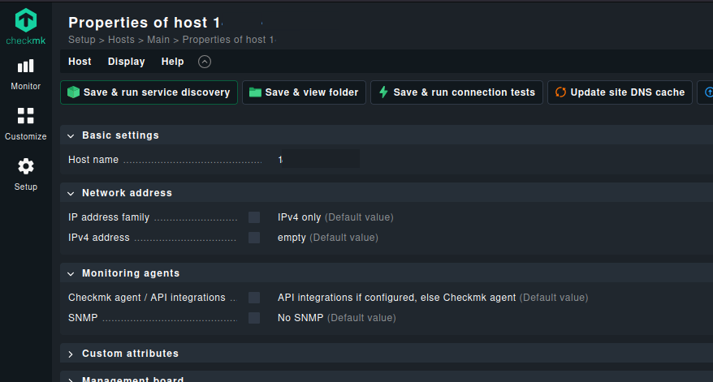
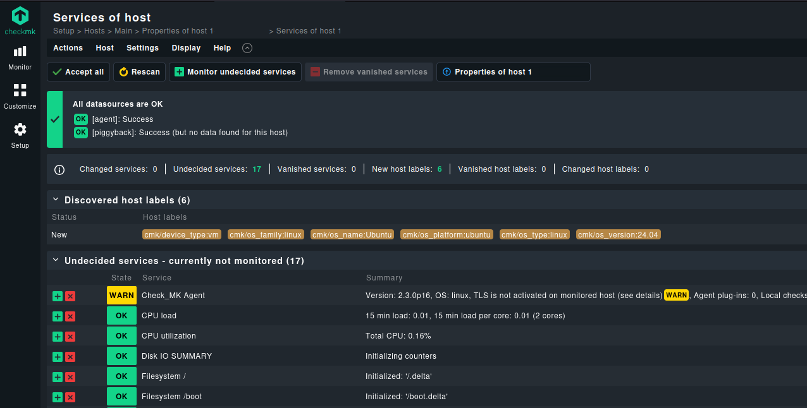
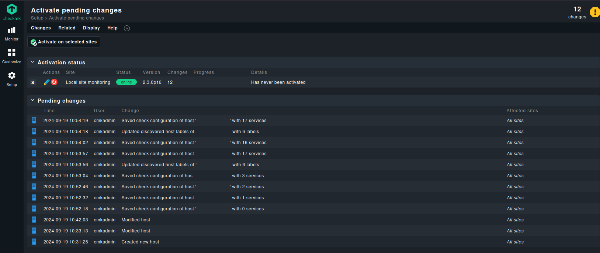
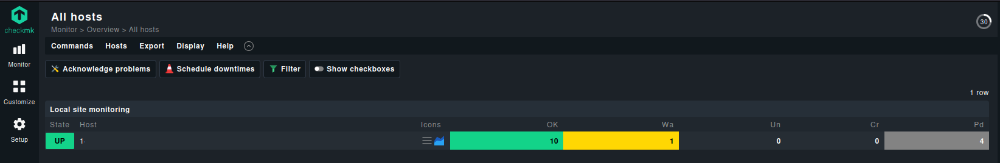

# Checkmk

```
your-server-ip-address > [IPADDRESS]
your-server-url > [URL]
your-server-name > [SERVER]
your-user-name > [USER]
your-user-password > [PASSWORD]
your-user-database > [DATABASE]
your-user-email > [EMAIL]
```

## Installation Host

1. Download Checkmk package

```bash
sudo wget https://download.checkmk.com/checkmk/2.3.0p16/check-mk-raw-2.3.0p16_0.noble_amd64.deb
```

2. Install the Checkmk package

```bash
sudo apt install check-mk-raw-2.3.0p16_0.noble_amd64.deb
```

3. Check the running omd version

```bash
omd version
```

4. Create a Checkmk monitoring site

Use the omd command to create a new Checkmk site. You can choose your own name, in this example we named the site "monitoring"

```bash
sudo omd create monitoring
```

After the site has been created you will see an output similar to the one below.

```
Adding /opt/omd/sites/monitoring/tmp to /etc/fstab.
Creating temporary filesystem /omd/sites/monitoring/tmp...OK
Updating core configuration...
Generating configuration for core (type nagios)...
Precompiling host checks...OK
Executing post-create script "01_create-sample-config.py"...OK
Executing post-create script "02_cmk-compute-api-spec"...OK
Restarting Apache...OK
Created new site monitoring with version 2.3.0p16.cre.

    The site can be started with omd start monitoring.
    The default web UI is available at http://checkmk/monitoring/

    The admin user for the web applications is cmkadmin with password: SETYkUOYCwLb
    For command line administration of the site, log in with 'omd su monitoring'.
    After logging in, you can change the password for cmkadmin with 'cmk-passwd cmkadmin'.
```

Here you can see the URL on which your site is accessible, default username, and an automatically generated password for accessing the site. The site is now created, but it still needs to be started. To start the site, type:

```bash
sudo omd start monitoring
```

When everything has been started successfully you will see an output similar to the one below.

```
Starting mkeventd...OK
Starting liveproxyd...OK
Starting mknotifyd...OK
Starting rrdcached...OK
Starting cmc...OK
Starting apache...OK
Starting dcd...OK
Starting redis...OK
Initializing Crontab...OK
```

5. Allow access to Checkmk in firewall [^1]

```bash
sudo ufw allow 80/tcp
sudo ufw allow 162/udp
sudo ufw allow 514/tcp
sudo ufw allow 514/udp
sudo ufw allow 6559/udp
sudo ufw allow 8000/tcp
sudo ufw disable
sudo ufw enable
```

## Installation Agent

1. Install the agent on the node

Before you can do anything, however, you must install the agent on your server. You can install the agent to any host on your network and then add the host to Checkmk. I’ll demonstrate by installing the agent to the hosting server and then adding the hosting server for monitoring.

On the Checkmk main site, go to Setup | Agents | ...



In the resulting window, you’ll want to copy the URL for the Linux DEB file. Then, on the hosting server, issue the command:

```bash
wget http://your-server/monitoring/check_mk/agents/check-mk-agent_2.3.0p16-1_all.deb
```

Once you’ve downloaded the installer to the hosting server, install it with the command:

```bash
sudo dpkg -i check-mk-agent*
```

2. Allow access to Checkmk in firewall [^1]

```bash
sudo ufw allow 161/udp
sudo ufw allow 6556/tcp
sudo ufw disable
sudo ufw enable
```

> **Note:**
> http://[IPADDRESS]

3. How to add the host [^2]

Now that you’ve installed the agent, we need to add the host to Checkmk. For that, go to Setup | Hosts and then click Add Host.



In the resulting window, type the hostname for the new host, and then click the checkbox for IPv4 Address and type the IP address for the host.



Click Save & Go To Service configuration and then, in the resulting window, click Accept All (or specific ones, by uncheck not wanted services).



Finally, click the yellow stop sign at the top right corner and then click the red circle associated with the host to activate the changes.



This action should take less than a minute. Once it completes, your host should then appear in the dashboard.



[^1]: https://docs.checkmk.com/latest/de/ports.html
[^2]: https://www.techrepublic.com/article/install-latest-checkmk-ubuntu/
