# Cockpit

```
your-server-ip-address > [IPADDRESS]
your-server-url > [URL]
your-server-name > [SERVER]
your-user-name > [USER]
your-user-password > [PASSWORD]
your-user-database > [DATABASE]
your-user-email > [EMAIL]
```

## Installation

```bash
sudo apt install cockpit
```

```bash
sudo systemctl start cockpit
sudo systemctl enable cockpit
sudo systemctl status cockpit
```

```bash
sudo ufw allow 9090
sudo ufw allow 80
sudo ufw allow 443
```

> **Note:**
> http://[IPADDRESS]:9090

## Usermanagement

```bash
sudo nano /etc/cockpit/disallowed-users
```

## WebInterface

### Login

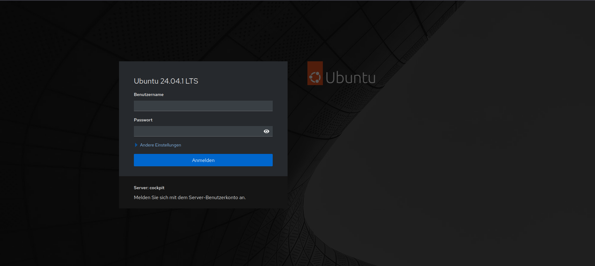

### Overview

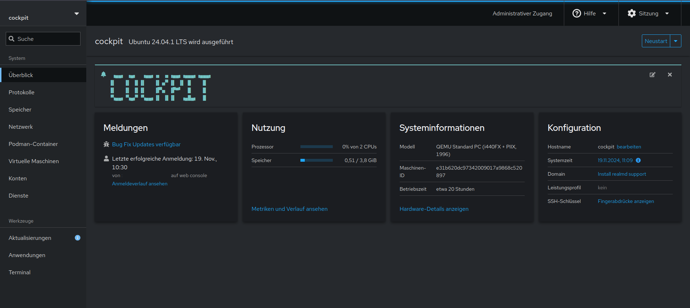

### Overview ‣ Hardware information

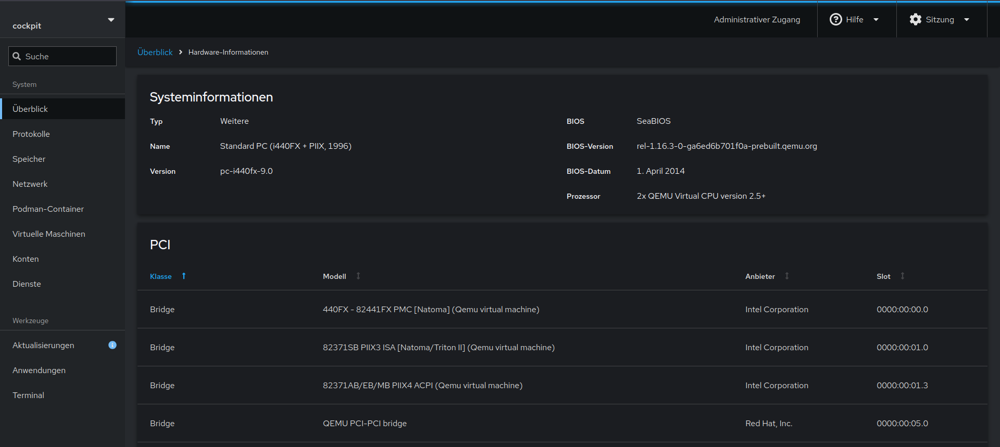

### Overview ‣ Metrics and history

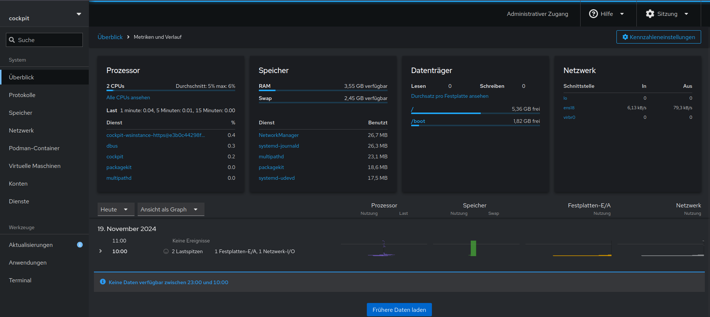

> **Note:**
> Error: Cannot refresh cache whilst offline

```bash
sudo apt install cockpit-pcp
```

### Logs

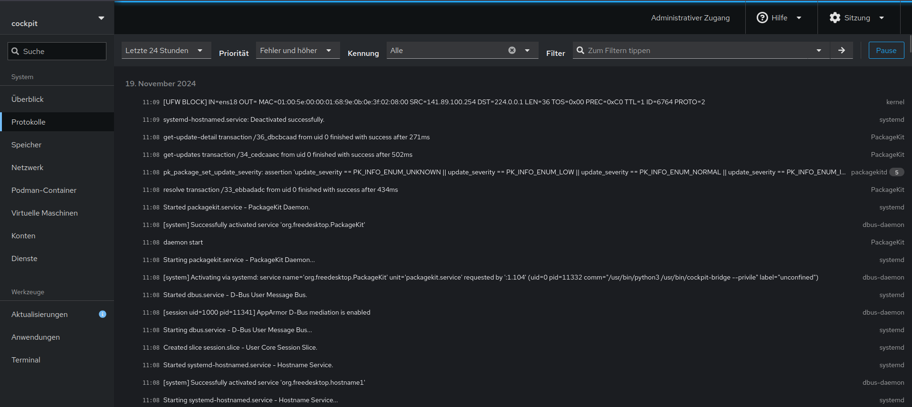

### Storage

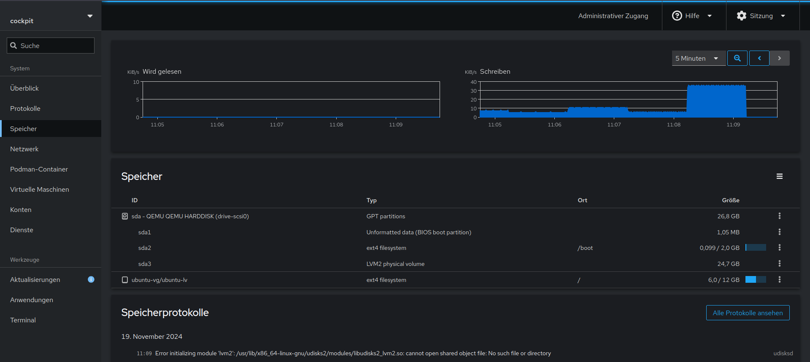

The screen is divided into blocks. The first one shows a graph that shows the overall Read and Write performance of the storage.

1. The Filesystems block shows the mounted filesystems.
2. The NFS Mounts block shows any mounted NFS connections.
3. The Storage Logs block shows relevant logs related to the storage devices on the system. It can be particularly useful when a disk starts failing.
4. The Drives block shows all the currently attached physical devices on the system, mounted or not. To create a new table partition, click on the drive, then click Create Partition Table. To create partitions, click on the drive, then click on Create Partition.
5. The Devices block shows volume groups, DM RAID, and VDO groups. To create a logical volume, select the Volume Group under Devices, and click on Create New Logical Volume.
6. The iSCSI Target block allows users to connect or disconnect from iSCSI targets. LUNs appear under Drives.

### Networking

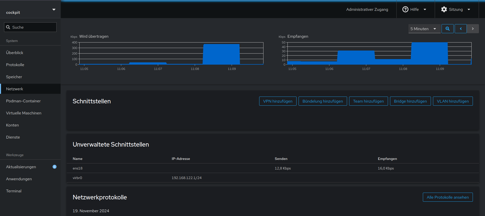

Existing network interfaces can be modified under the Interfaces block. To create a VLAN interface, click on Add VLAN. Likewise, to create a bridge, click on Add Bridge. To create a bonded NIC, click on Add Bond.

To create firewall rules, click on the Active Zone in the Firewall block.

### Podman Containers

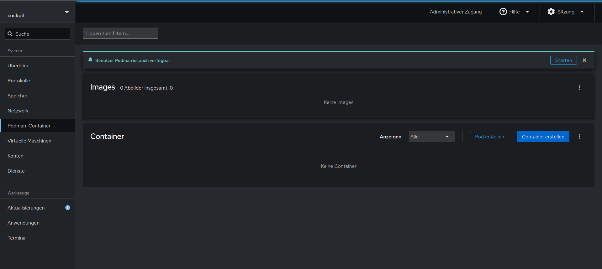

```bash
sudo apt install cockpit-podman
```

### Virtual Machines

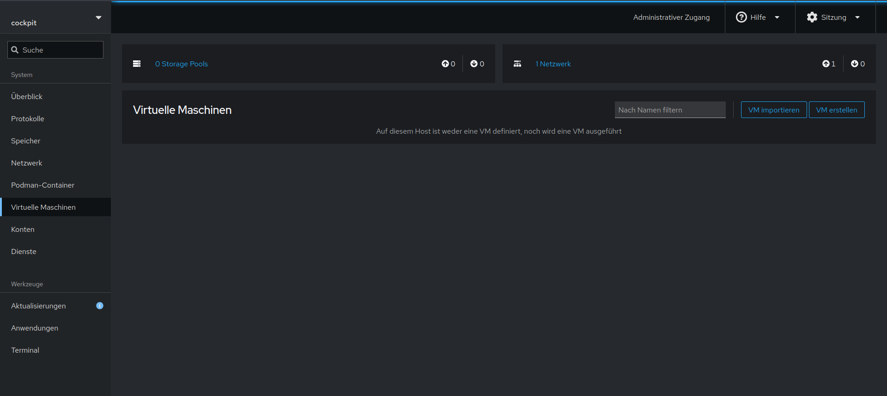

```bash
sudo apt install cockpit-machines
```

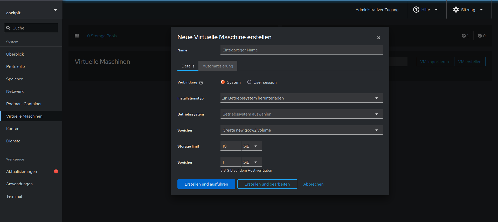

1. To create a new storage pool, click Storage Pool -> Create Storage Pool
2. To create a new libvirt network, click Networks -> Create Virtual Network
3. To create a new virtual machine, click on Create VM.
4. The Installation Type field allows users to install a Linux distribution from the Internet, use a local install media like an ISO, or use PXE to boot the virtual machine.
5. For this feature to work, a network and storage pool called default should exist.
6. To create a virtual machine from an existing virtual disk image, use the Import VM button. It is similar to Create VM.

### Accounts

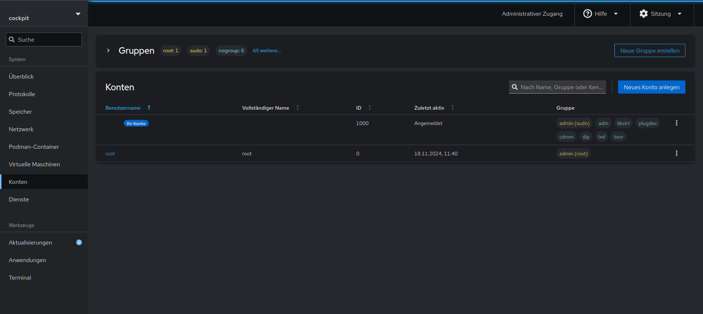

### Services

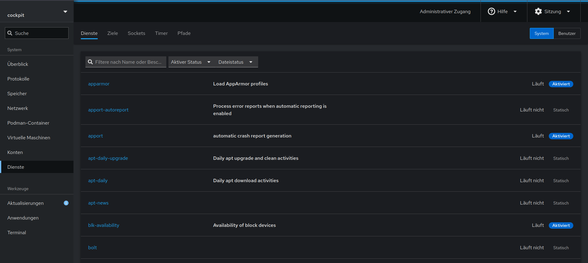

### Software Updates

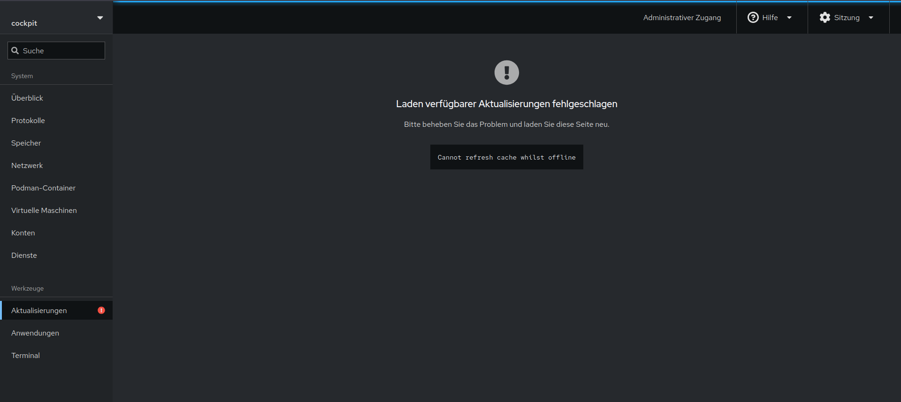

> **Note:**
> Error: Cannot refresh cache whilst offline

### Applications


### Terminal

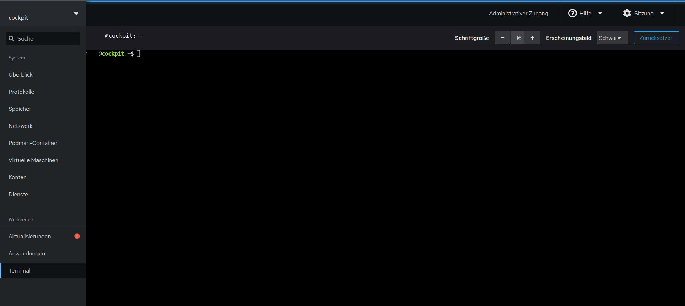

### Hosts

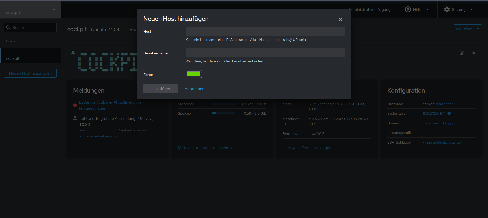

[^1]: https://cockpit-project.org/guide/latest/
[^2]: https://cockpit-project.org/applications.html
