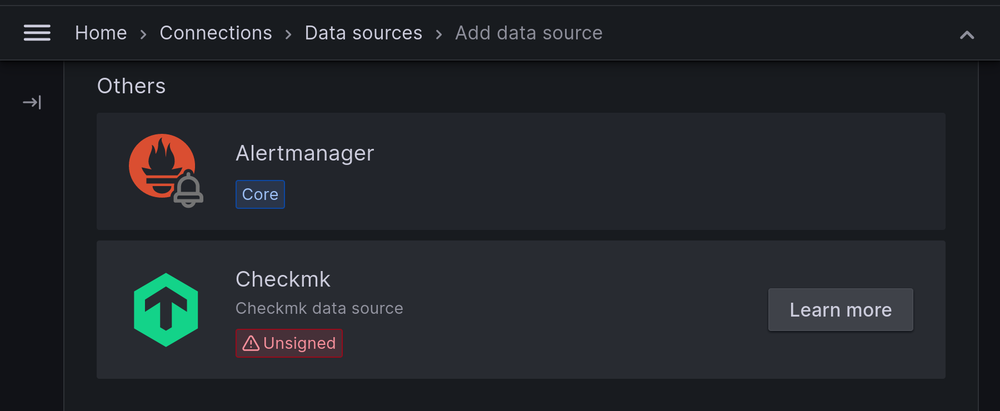

# Grafana

```
your-server-ip-address > [IPADDRESS]
your-server-url > [URL]
your-server-name > [SERVER]
your-user-name > [USER]
your-user-password > [PASSWORD]
your-user-database > [DATABASE]
your-user-email > [EMAIL]
```

## Installation (Server)

1. Run the following command to add the Grafana repository to your system:

```bash
sudo apt install apt-transport-https software-properties-common wget
sudo wget -q -O - https://packages.grafana.com/gpg.key | sudo apt-key add -
echo "deb https://apt.grafana.com stable main" | sudo tee /etc/apt/sources.list.d/grafana.list
```

2. Update the package list and install Grafana with the following commands:

```bash
sudo apt update
sudo apt install grafana
```

3. Start the Grafana service and check its status

```bash
sudo systemctl enable grafana-server
sudo systemctl start grafana-server
sudo systemctl status grafana-server
```

4. Allow access to Grafana Web Interface in firewall

```bash
sudo ufw allow 3000/tcp
sudo ufw disable
sudo ufw enable
```

5. Set the admin password to a new value

```bash
sudo systemctl stop grafana-server
sudo grafana-cli admin reset-admin-password <new_password>
sudo systemctl start grafana-server
```

With Grafana running successfully, open your web browser and go to:

> **Note:**
> http://[IPADDRESS]:3000

## Configuring the Data Source

### Prometheus [^1]

#### Data Source

Before you can start using Grafana for monitoring, you need to connect at least one data source. In this tutorial, we will use the previously configured Prometheus server as the data source.

1. Adding a new data source to Grafana is done by clicking on the gear icon in the left side of the screen and selecting the Data sources item. You will see a page indicating that there are no data sources yet.


2. Clicking the Add data source button will take you to a page listing the available sources that are shipped with Grafana by default. This listing can be expanded by installing additional plugins . The Prometheus source we need here is at the very beginning of the list, so hover the mouse over it and click the Select button.


3 .You will see the configuration page for the Prometheus data source:


4. Since we installed Grafana on the same server as Prometheus, we only need to change a couple of options. Let's go through the basic settings:

   Name: setting a unique name for the data source here is useful for differentiating between multiple Prometheus servers.
   Default: turning this option on causes this data source to be preselected in new panels that you create.
   URL: this option sets the full path to the Prometheus API. In our case, it's http://localhost:9090.

You can leave all the other options as is, and scroll down the page until you find the Save & test button. When you click this button, you will see the following confirmation message:


Now that the Prometheus data source is successfully configured, let's take a look at the dashboard that ships with the plugin in the next section.

#### Dashboards

5. Importing and exploring the Prometheus stats dashboard

Several pre-configured dashboards are supplied with the Prometheus plugin for Grafana. Without leaving the data source settings, navigate to the Dashboards tab. You will see a list of dashboards available for importing:


Select any dashboard from the list and click on the Import button. Afterward, click on its name to go to the dashboard page. You will observe plots of various metrics related to the Prometheus server, such as the count of samples appended by the server, the duration for all evaluations to execute, memory consumption, Write-Ahead Log (WAL) corruptions, and others.


In the next section, we will create a custom dashboard that displays one of the metrics received from our Node Exporter server on it.

6. Creating a custom Prometheus dashboard

In this section, we will create a custom dashboard and add a graph plotting the utilization of the root partition on our Node Exporter server. To add a new dashboard, click on the Dashboard icon in the menu on the left side of the screen.

On the main windows click on "Create Dashboard" or click on the right side on "New" > "New dashboard"


Now click on "Start your new dashboard by adding a visualization"


Now we have to select the data source we created before.


After set the Prometheus source, it will display an empty dashboard. We now need to enter the metric that we want to display on the graph. To do this:

- Fill in the "Builder" > fields:


or

- Enter the following in the "Code" > "Metrics browser" field:


##### Community Dashboards

Sometimes it might make more sense to find a ready-made dashboard and customize it as needed instead of creating one from scratch. There are more than 5000 community dashboards available at the time of writing. To see a list of currently available dashboards, follow [this link](https://grafana.com/grafana/dashboards/) in your browser. You will be taken to a page containing all dashboards created by other Grafana users. On the left side of the page, there are options for filtering the list.

### Checkmk

#### Data Source

##### Requirements

To make use of the plugin, you need to take care the correct versions are installed. You need to match both, the Grafana and the Checkmk version:

Grafana 9.5.15 or higher Current and previous major version of Grafana
Checkmk Cloud or Checkmk MSP 2.2.0 or higher for the signed plugin available from [Grafana](https://grafana.com/grafana/plugins/checkmk-cloud-datasource/)
Checkmk 2.1.0 or higher for the unsigned plugin available from [Github](https://github.com/Checkmk/grafana-checkmk-datasource/releases)

Installing the plug-in

##### signed plug-in

The signed plug-in can be installed from the Grafana marketplace or by using the grafana-cli:

```bash
sudo grafana-cli plugins install checkmk-cloud-datasource
sudo systemctl restart grafana-server
```

##### un-signed lug-in

On the releases page of the GitHub repository you will find two variants of the plugin as a zip archive:

- The signed variant checkmk-cloud-datasource-X.Y.Z.zip mentioned above, which can only be used with Checkmk Cloud.
- A variant that uses the old naming scheme tribe-29-checkmk-datasource-X.Y.Z.zip, for all editions from Checkmk 2.1.0 upwards.

Simply download the latest version as a zip file and copy it to the Grafana server.

```bash
wget https://github.com/Checkmk/grafana-checkmk-datasource/releases/download/v3.3.0/tribe-29-checkmk-datasource-3.3.0.zip
```

Now unpack the zip archive:

```bash
unzip tribe-29-checkmk-datasource-3.3.0.zip
```

Create a plugin directory if it does not already exist and make the Linux user under whose ID the Grafana processes are running (usually grafana) its owner:

```bash
mkdir -p /var/lib/grafana/plugins
chown grafana:grafana /var/lib/grafana/plugins
```

Move the resulting folder to the Grafana plugin directory. Usually this is the path /var/lib/grafana/plugins/ and change the owner to the Grafana user:

```bash
mv -v tribe-29-checkmk-datasource /var/lib/grafana/plugins/tribe-29-checkmk-datasource
chown -R grafana:grafana /var/lib/grafana/plugins/tribe-29-checkmk-datasource
```

Since Grafana 8.0, it is no longer possible to easily include external plugins as long as they are not signed. This also applies to the Checkmk plugin, so you need an additional step. To do this, adjust the configuration file /etc/grafana/grafana.ini in the [plugins] section. Here, change the line as follows:

```bash
sudo nano /etc/grafana/grafana.ini
```

```
[plugins]
allow_loading_unsigned_plugins = tribe-29-checkmk-datasource
```

After installing the plugin, updating or changing the configuration file, restart the Grafana server service:

```bash
sudo systemctl restart grafana-server
```

##### Create Grafana user in Checkmk

The Grafana connection requires a user on the Checkmk side who has sufficient permissions and who also authenticates himself with an automation password (automation secret) instead of a password. Normal guest or monitoring users are not sufficient, but for security reasons you should not use an administrator.

The easiest way to get a "suitable" user is to choose the "automation" user and create an automation password (automation secret).


##### Activate and set up the plugin

After the necessary files have been installed, you can activate the plugin in Grafana. To do this, go to the configuration and select the Data sources tab. Here you can add a new data source using the Add data source button:


You can find the entry for Checkmk below in the Others category:



The form for this data source is quite simple. Enter the URL to your instance, the type of your edition and the user you just created for Grafana. Important: If you are using Checkmk in a distributed environment, enter the URL to your central instance here:


If you want to connect multiple Checkmk instances, you can optionally give each connection a unique name. Otherwise, just leave the standard Checkmk or Checkmk for Cloud Edition.

After you have saved the connection with the Save & test button, it is available as a data source in Grafana and you can configure your first graphs.

[^1]: https://betterstack.com/community/guides/monitoring/visualize-prometheus-metrics-grafana/
[^2]: https://docs.checkmk.com/latest/de/grafana.html
