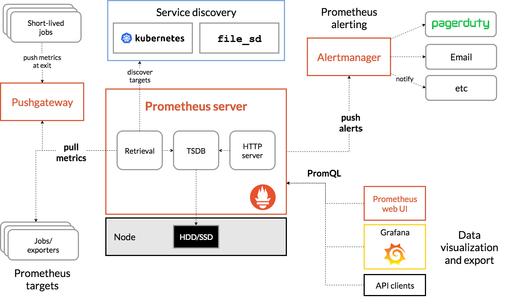

# Prometheus [^1] [^2] [^3] [^4]

Prometheus is an event monitoring and alerting application for cloud infrastructures. The project is written in Go and is one of the Graduate Projects in the Cloud Native Computing Foundation. It is considered the de-facto monitoring in the cloud.

The idea with Prometheus is that a central node aggregates metrics and alerting information. The metrics are pulled from a previously declared number of nodes via HTTP pulling. These nodes, also called targets, expose this information. The Prometheus server aggregates these in a time series database, triggers push alerts if available, and can expose the data for further processing by data visualization tools such as Grafana.



## Installation (Server)

1. Update System Packages

You should first update your system's package list to ensure that you are using the most recent packages. To accomplish this, issue the following command:

```bash
sudo apt update
```

2. Create a System User for Prometheus

Now create a group and a system user for Prometheus. To create a group and then add a user to the group, run the following command:

```bash
sudo groupadd --system prometheus
sudo useradd -s /sbin/nologin --system -g prometheus prometheus
```

This will create a system user and group named "prometheus" for Prometheus with limited privileges, reducing the risk of unauthorized access.

3. Create Directories for Prometheus

To store configuration files and libraries for Prometheus, you need to create a few directories. The directories will be located in the /etc and the /var/lib directory respectively. Use the commands below to create the directories:

```bash
sudo mkdir /etc/prometheus
sudo mkdir /var/lib/prometheus
```

4. Download Prometheus and Extract Files

To download the latest update, go to the Prometheus official downloads site and copy the download link for Linux Operating System. Download using wget and the link you copied like so:

```bash
wget https://github.com/prometheus/prometheus/releases/download/v2.54.1/prometheus-2.54.1.linux-amd64.tar.gz
```

After the download has been completed, run the following command to extract the contents of the downloaded file:

```bash
tar vxf prometheus*.tar.gz
```

5. Navigate to the Prometheus Directory

After extracting the files, navigate to the newly extracted Prometheus directory using the following command:

```bash
cd prometheus*
```

6. Move the Binary Files & Set Owner

First, you need to move some binary files (prometheus and promtool) and change the ownership of the files to the "prometheus" user and group. You can do this with the following commands:

```bash
sudo mv prometheus /usr/local/bin
sudo mv promtool /usr/local/bin
sudo chown prometheus:prometheus /usr/local/bin/prometheus
sudo chown prometheus:prometheus /usr/local/bin/promtool
```

7. Move the Configuration Files & Set Owner

Next, move the configuration files and set their ownership so that Prometheus can access them. To do this, run the following commands:

```bash
sudo mv consoles /etc/prometheus
sudo mv console_libraries /etc/prometheus
sudo mv prometheus.yml /etc/prometheus
sudo chown prometheus:prometheus /etc/prometheus
sudo chown -R prometheus:prometheus /etc/prometheus/consoles
sudo chown -R prometheus:prometheus /etc/prometheus/console_libraries
sudo chown -R prometheus:prometheus /var/lib/prometheus
```

8. Create Prometheus Systemd Service

Now, you need to create a system service file for Prometheus. Create and open a prometheus.service file with the Nano text editor using:

```bash
sudo nano /etc/systemd/system/prometheus.service
```

```
[Unit]
Description=Prometheus
Wants=network-online.target
After=network-online.target

[Service]
User=prometheus
Group=prometheus
Type=simple
ExecStart=/usr/local/bin/prometheus \
    --config.file /etc/prometheus/prometheus.yml \
    --storage.tsdb.path /var/lib/prometheus/ \
    --web.console.templates=/etc/prometheus/consoles \
    --web.console.libraries=/etc/prometheus/console_libraries

[Install]
WantedBy=multi-user.target
```

The "systems" service file for Prometheus defines how Prometheus should be managed as a system service on Ubuntu. It includes the service configuration, such as the user and group it should run as. It also includes the path to the Prometheus binary and the Prometheus configuration file location. Additionally, the file can be used to set storage locations for metrics data and pass additional command-line options to the Prometheus binary when it starts.

9. Reload Systemd

You need to reload the system configuration files after saving the prometheus.service file so that changes made are recognized by the system. Reload the system configuration files using the following:

```bash
sudo systemctl daemon-reload
```

10. Start Prometheus Service

Next, you want to enable and start your Prometheus service. Do this using the following commands:

```bash
sudo systemctl enable prometheus
sudo systemctl start prometheus
```

11. Check Prometheus Status

After starting the Prometheus service, you may confirm that it is running or if you have encountered errors using:

```bash
sudo systemctl status prometheus
```

12. Allow access to Prometheus Web Interface in firewall

```bash
sudo ufw allow 9090/tcp
```

With Prometheus running successfully, you can access it via your web browser using:

> **Note:**
> http://your-server-ip-address:9090

## Installation (Client)

### Node Exporter [^5] [^6]

The Node Exporter is an agent that gathers system metrics and exposes them in a format which can be ingested by Prometheus. The Node Exporter is a project that is maintained through the Prometheus project. This is a completely optional step and can be skipped if you do not wish to gather system metrics. The following will need to be performed on each server that you wish to monitor system metrics for.

1. Download Node Exporter

```bash
wget https://github.com/prometheus/node_exporter/releases/download/v1.8.2/node_exporter-1.8.2.linux-amd64.tar.gz
```

2. Create User and Folder

```bash
sudo groupadd --system node_exporter
sudo useradd -s /sbin/nologin --system -g node_exporter node_exporter
sudo mkdir /etc/node_exporter
sudo chown node_exporter:node_exporter /etc/node_exporter
```

mv node_exporter-1.0.1.linux-amd64 node_exporter-files

3. Unpack Node Exporter Binary

```bash
tar -xvf node_exporter-*
mv node_exporter-* node_exporter-files
```

4. Install Node Exporter

```bash
sudo mv node_exporter-files/node_exporter /usr/local/bin/
sudo chown node_exporter:node_exporter /usr/local/bin/node_exporter
```

5. Create Node Exporter Systemd Service

```bash
sudo nano /etc/systemd/system/node_exporter.service
```

```
[Unit]
Description=Node Exporter
Documentation=https://prometheus.io/docs/guides/node-exporter/
Wants=network-online.target
After=network-online.target

[Service]
User=node_exporter
Group=node_exporter
Type=simple
Restart=on-failure
ExecStart=/usr/local/bin/node_exporter \
  --web.listen-address=:9100

[Install]
WantedBy=multi-user.target
```

```bash
sudo chmod 664 /etc/systemd/system/node_exporter.service
```

6. Start the node_exporter daemon and check its status

```bash
sudo systemctl daemon-reload
sudo systemctl enable node_exporter
sudo systemctl start node_exporter
sudo systemctl status node_exporter
```

7. Allow access to Node Exporter in firewall

```bash
sudo ufw allow 9100/tcp
sudo ufw disable
sudo ufw enable
```

8. Verify Node Exporter is Running

> **Note:**
> http://your-server-ip-address:9100/metrics

#### Node Importer to Prometheus [^7] [^8]

Your locally running Prometheus instance needs to be properly configured in order to access Node Exporter metrics. The following prometheus.yml example configuration file will tell the Prometheus instance to scrape, and how frequently, from the Node Exporter via localhost:9100:

```bash
sudo nano /etc/prometheus/prometheus.yml
```

Add under scrape_configs:

```
  - job_name: "node_exporter"
    static_configs:
    - targets: ["ip-from-node_exporter:9100"]
```

```bash
sudo systemctl restart prometheus
```

#### Example metrics:

| Metric                                        | Meaning                                                                                                |
| --------------------------------------------- | ------------------------------------------------------------------------------------------------------ |
| node_os_info                                  | OS metrics - complete information on the operating system.                                             |
| node_cpu_seconds_total                        | CPU metrics - the CPU has spent a cumulative total of seconds in each mode (user, system, idle, etc.). |
| node_cpu_seconds_total{mode=system}           | CPU metrics - total CPU time spent in idle mode.                                                       |
| node_memory_MemTotal_bytes                    | Memory metrics - the total system memory.                                                              |
| node_memory_MemFree_bytes                     | Memory metrics - the amount of free system memory.                                                     |
| node_memory_Cached_bytes                      | Memory metrics - the amount of memory used for caching data.                                           |
| node_network_receive_bytes_total              | Network metrics - total bytes received on all network interfaces.                                      |
| node_network_transmit_bytes_total             | Network metrics - total bytes transmitted on all network interfaces.                                   |
| node_network_receive_bytes{device=”eth0″}     | Network metrics - bytes received on a specific network interface.                                      |
| node_disk_io_time_seconds_total               | Disk I/O metrics - cumulative seconds spent doing I/Os.                                                |
| node_disk_io_time_seconds_total{device=”sda”} | Disk I/O metrics - cumulative seconds spent doing I/Os on a specific disk.                             |
| node_filesystem_size_bytes                    | Filesystem metrics - total size of the filesystem.                                                     |
| node_filesystem_free_bytes                    | Filesystem metrics - free space on the filesystem.                                                     |
| node_boot_time_seconds                        | Uptime metrics - the timestamp when the node was last booted.                                          |
| node_load1                                    | System load metrics - the 1-minute load averages.                                                      |
| node_load5                                    | System load metrics - the 5-minute load averages.                                                      |
| node_load15                                   | System load metrics - the 15-minute load averages.                                                     |
| node_filesystem_read_bytes_total              | Filesystem read/write metrics - total bytes read from all filesystems.                                 |
| node_filesystem_write_bytes_total             | Filesystem read/write metrics - total bytes are written to all filesystems.                            |

## Backup (Server)

1. Back up the Prometheus configuration details and data

To back up the Prometheus configuration details and data, use the following command:

```bash
sudo cp -r /etc/prometheus /etc/prometheus_backup
```

2. Stop the Prometheus service

To stop the Prometheus service, use the following command:

```bash
sudo systemctl stop prometheus
```

3. Download and extract the new Prometheus version

To download the new Prometheus version, use the following command:

```bash
wget https://github.com/prometheus/node_exporter/releases/download/*
```

To extract the new Prometheus version, use the following command:

```bash
tar -xf prometheus-*
```

4. Replace the binary and configuration files

To replace the Prometheus binary files, use the following command:

```bash
mv prometheus-*/prometheus /usr/local/bin/
```

To replace the Prometheus configuration file, use the following command:

```bash
cp prometheus-*/prometheus.yml /etc/prometheus/
```

5. Start the Prometheus service

To start the Prometheus service, use the following command:

```bash
sudo systemctl start prometheus
```

6. Back up Node Exporter configuration details and data

To back up the Node Exporter configuration details and data, use the following command:

```bash
cp /etc/systemd/system/node_exporter.service /etc/systemd/system/node_exporter.service_backup
```

7. Download and extract the new Node Exporter version

To download the new Node Exporter version, use the following command:

```bash
wget https://github.com/prometheus/node_exporter/releases/download/*
```

To extract the new Node Exporter version, use the following command:

```bash
tar -xf node_exporter-*
```

8. Replace the Node Exporter binary file

To replace the Node Exporter binary file, use the following command:

```bash
mv node_exporter-*/node_exporter /usr/local/bin/
```

9. Start the Node Exporter service

To start the Node Exporter service, use the following command:

```bash
sudo systemctl start node_exporter
```

[^1]: https://www.cherryservers.com/blog/install-prometheus-ubuntu
[^2]: https://medium.com/@abdullah.eid.2604/prometheus-installation-on-linux-ubuntu-c4497e5154f6
[^3]: https://ibrahims.medium.com/how-to-install-prometheus-and-grafana-on-ubuntu-22-04-lts-configure-grafana-dashboard-5d11e3cb3cfd
[^4]: https://b-nova.com/home/content/getting-started-with-prometheus/
[^5]: https://prometheus.io/docs/instrumenting/exporters/
[^6]: https://developer.couchbase.com/tutorial-node-exporter-setup
[^7]: https://prometheus.io/docs/guides/node-exporter/
[^8]: https://www.stackhero.io/en/services/Prometheus/documentations/Using-Node-Exporter
[^9]: https://geekflare.com/de/prometheus-grafana-intro/
[^10]: https://nsrc.org/workshops/2021/pacnog29/nmm/netmgmt/en/prometheus/ex-node-exporter.htm
[^11]: https://techannotation.wordpress.com/2021/07/19/irate-vs-rate-whatre-they-telling-you/
[^12]: https://www.liquidweb.com/blog/install-prometheus-node-exporter-on-linux-almalinux/
