# Ubuntu Server

```
your-server-ip-address > [IPADDRESS]
your-server-url > [URL]
your-server-name > [SERVER]
your-user-name > [USER]
your-user-password > [PASSWORD]
your-user-database > [DATABASE]
your-user-email > [EMAIL]
```

## Installation

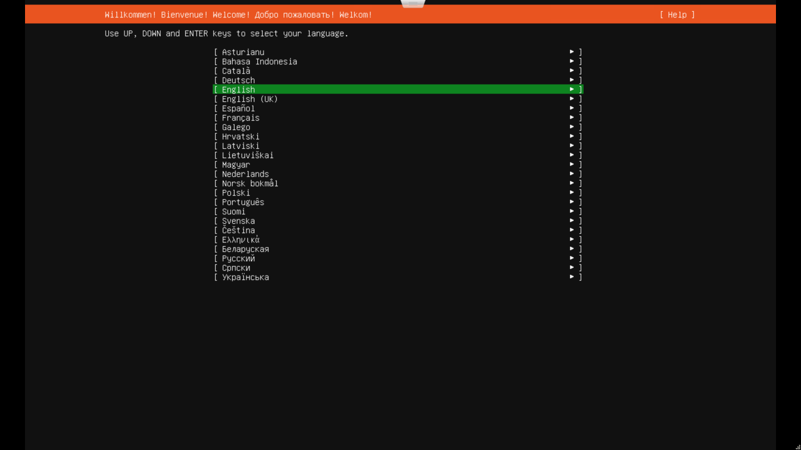
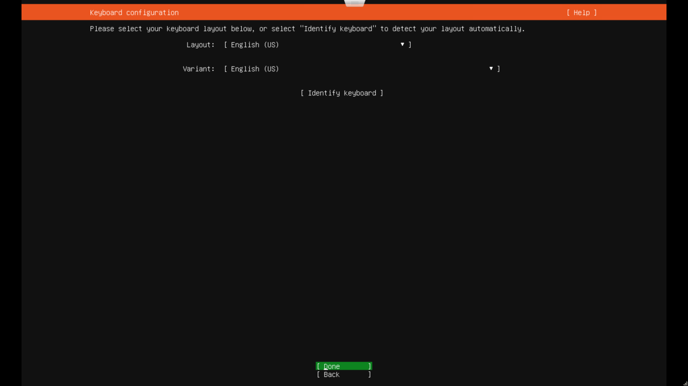
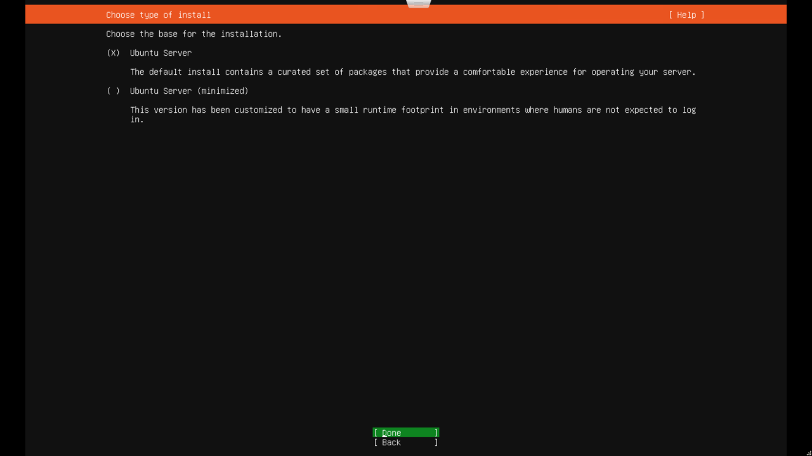
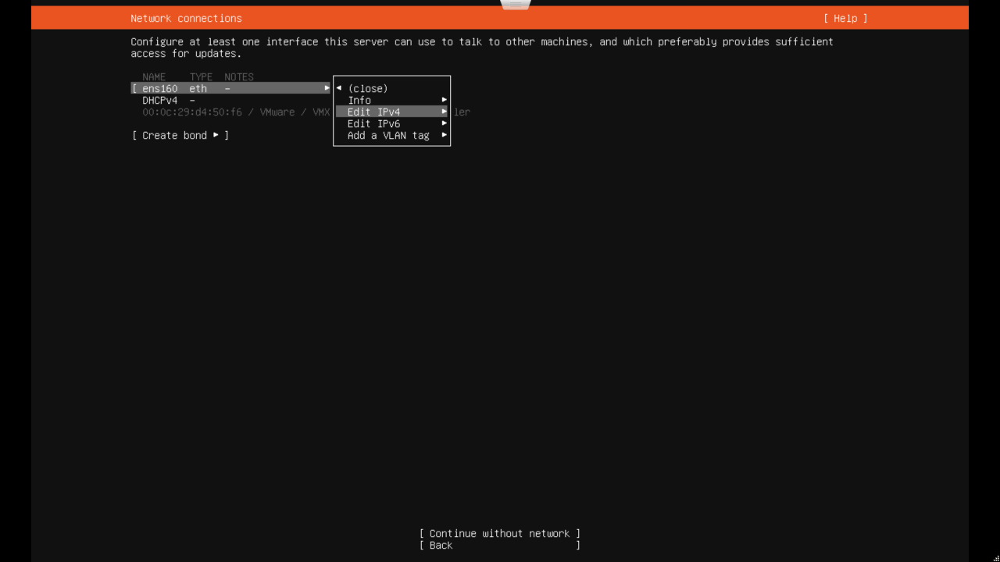
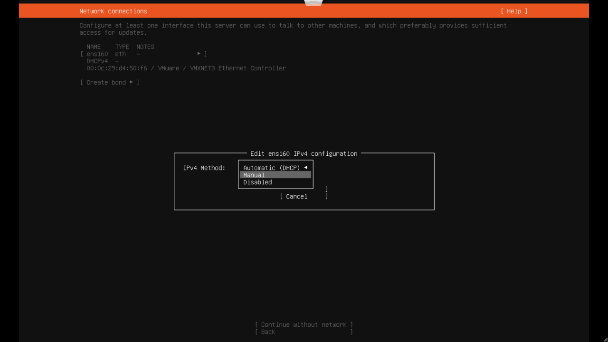
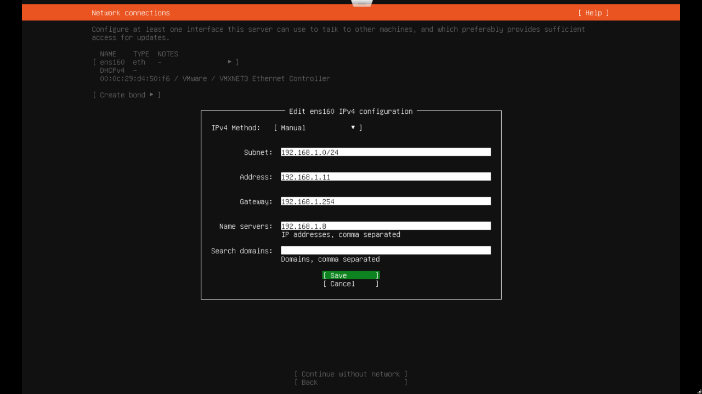
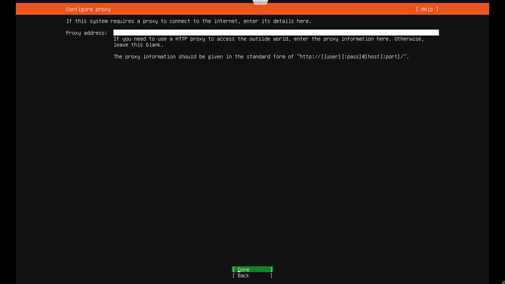
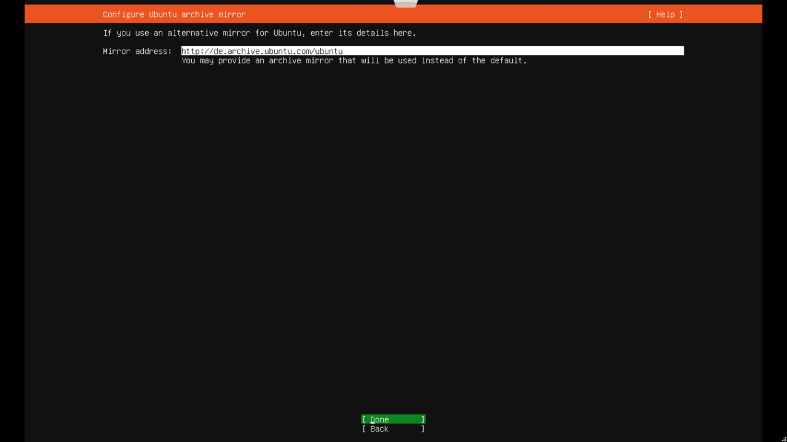
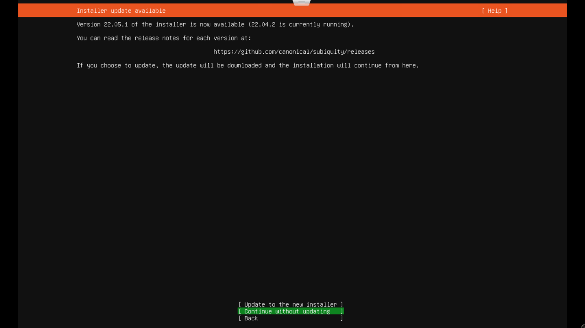
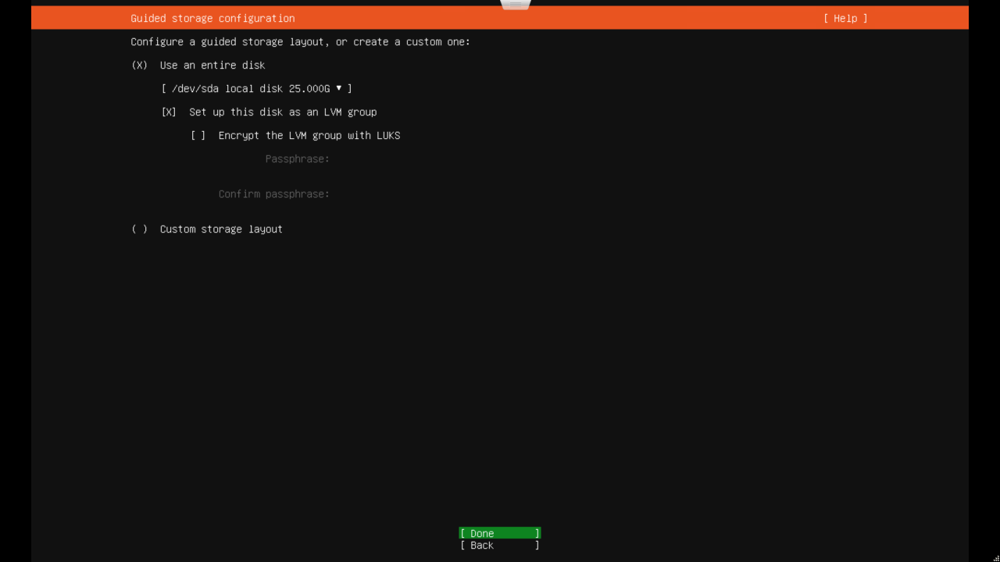
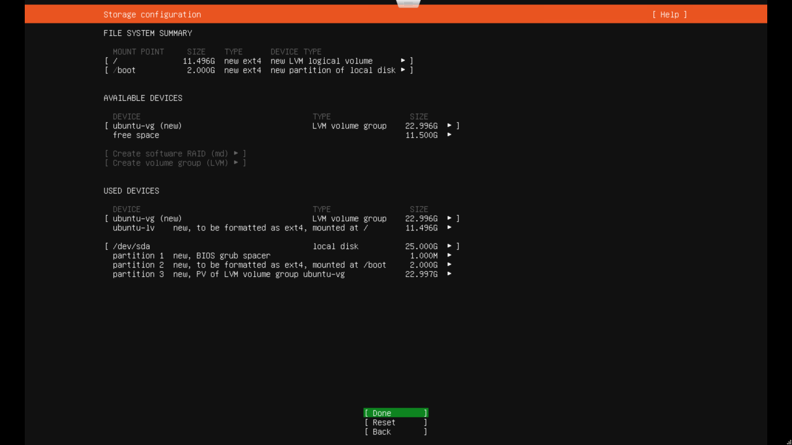
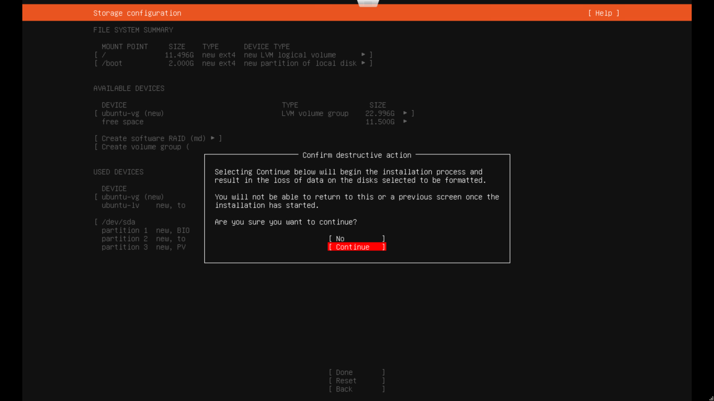
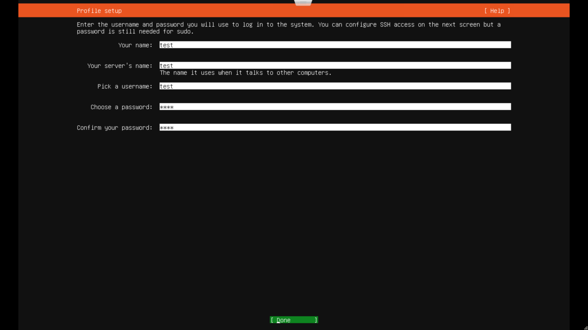
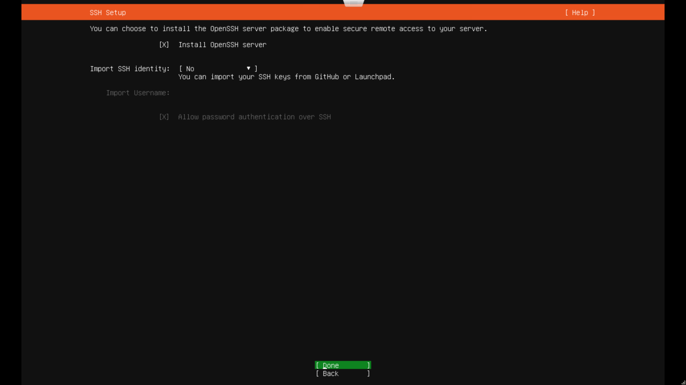
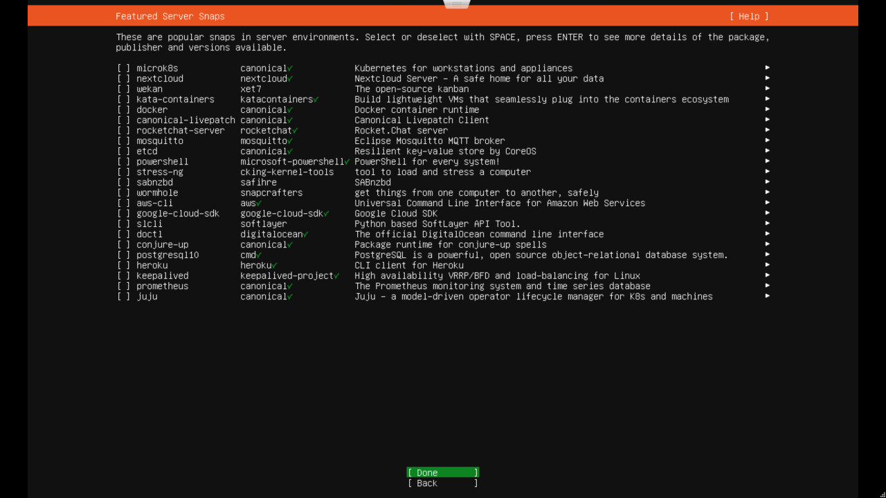
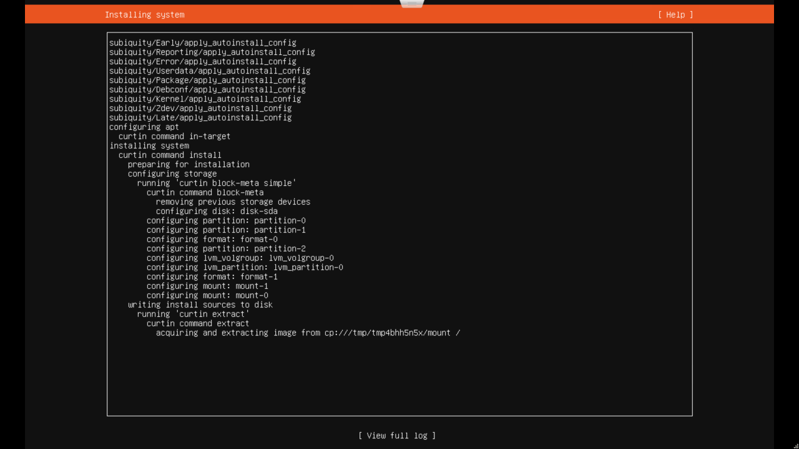
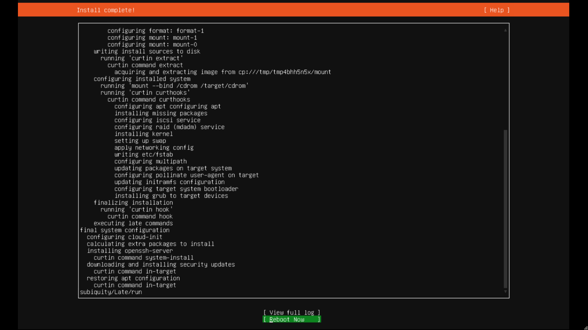

### Updates

```bash
sudo apt update
sudo apt upgrade
```

### Cleanup

```bash
sudo apt clean
sudo apt autoclean
sudo apt autoremove
```

### Cleanup via CronJob [^5]

```bash
sudo nano ucleaner.sh
```

```
echo "\n\nSYSTEM CLEANUP\n\n"
echo "-------------------------------------------------------\n\n"

if [ $USER != root ]; then
  echo "\nError: must be root"
  echo "\nExiting..."
  exit 0
fi

echo "\n\nBefore command execution:-"
free -h

echo "\n\nClearing caches..."
sync; echo 1 > /proc/sys/vm/drop_caches

echo "\n\nRemoving old kernels..."
echo "Current kernel:-"
a=`uname -r|cut -f "2" -d "-"`
a=$(($a-2))
apt remove --purge linux-image-3.16.0-$a-generic

echo "\n\nClearing swap space..."
swapoff -a && swapon -a

echo "\n\nClearing application dependencies..."
apt clean
apt autoclean
apt autoremove

echo "\n\nEmptying every trashes..."
rm -rf /home/*/.local/share/Trash/*/**
rm -rf /root/.local/share/Trash/*/**

echo "\n\nAfter command execution:-"
free -h
```

```bash
sudo crontab -e
```

```
# Every Monday on 05:00 AM
0 5 * * 1	/home/ucleaner.sh
```

### Set Time Zone

```bash
sudo timedatectl set-timezone Europe/Berlin
sudo timedatectl
```

### Set Time Synchronization

```bash
sudo timedatectl set-ntp on
```

```bash
sudo nano /etc/systemd/timesyncd.conf
```

```
[Time]
NTP=time.uni-potsdam.de
FallbackNTP=times.tubit.tu-berlin.de
```

```bash
sudo systemctl restart systemd-timesyncd
sudo systemctl status systemd-timesyncd
```

### Set Hostname

```bash
sudo hostnamectl set-hostname [SERVER]
sudo nano /etc/cloud/cloud.cfg
```

```
FROM: preserve_hostname: false
TO: preserve_hostname: true
```

```bash
sudo nano /etc/hosts
```

```
127.0.0.1 localhost
127.0.1.1 [SERVER]
[IPADDRESS] name.subdomain.sldomain.tldomain
```

```bash
sudo hostnamectl
```

### Set IP-Address

#### Netplan (new) [^1]

```bash
sudo nano /etc/netplan/00-installer-config.yaml
```

##### Fixed IP

```
network:
    version: 2
    renderer: networkd
    ethernets:
        en01:
            addresses:
            - [IPADDRESS]/24
            - "2001:1::1/64"
            gateway4: [IPADDRESS]
            gateway6: "2001:1::2"
            nameservers:
                addresses:
                - 8.8.8.8
                - xxx.xxx.xxx.xxx
```

```bash
sudo netplan apply
```

##### DHCP

```
network:
    version: 2
    renderer: networkd
    ethernets:
        en01:
            dhcp4: true
            dhcp6: true
```

```bash
sudo netplan apply
```

#### Network Interfaces (old) [^2]

```bash
sudo nano /etc/network/interfaces
```

##### Fixed IP

```
source /etc/network/interfaces.d/*

auto lo
iface lo inet loopback

auto en01
iface en01 inet static
    address [IPADDRESS]
    netmask 255.255.255.0
    network xxx.xxx.xxx.0
    broadcast xxx.xxx.xxx.255
    gateway xxx.xxx.xxx.xxx
    dns-nameservers xxx.xxx.xxx.xxx
    dns-search subdomain.domain.toplevel
```

```bash
sudo service networking restart
```

##### DHCP

```
source /etc/network/interfaces.d/*

auto lo
iface lo inet loopback

auto eth0
iface eth0 inet dhcp
```

```bash
sudo service networking restart
```

### Change Password

```bash
sudo passwd [USER]
```

### Message of the Day [^3] [^4]

```bash
sudo nano /etc/motd
```

```

.-----------------------------------------------------------------------------.
||Es| |F1 |F2 |F3 |F4 |F5 | |F6 |F7 |F8 |F9 |F10|                  C= AMIGA   |
||__| |___|___|___|___|___| |___|___|___|___|___|                             |
| _____________________________________________     ________    ___________   |
||~  |! |" |§ |$ |% |& |/ |( |) |= |? |` || |<-|   |Del|Help|  |{ |} |/ |* |  |
||`__|1_|2_|3_|4_|5_|6_|7_|8_|9_|0_|ß_|´_|\_|__|   |___|____|  |[ |]_|__|__|  |
||<-  |Q |W |E |R |T |Z |U |I |O |P |Ü |* |   ||               |7 |8 |9 |- |  |
||->__|__|__|__|__|__|__|__|__|__|__|__|+_|_  ||               |__|__|__|__|  |
||Ctr|oC|A |S |D |F |G |H |J |K |L |Ö |Ä |^ |<'|               |4 |5 |6 |+ |  |
||___|_L|__|__|__|__|__|__|__|__|__|__|__|#_|__|       __      |__|__|__|__|  |
||^    |> |Y |X |C |V |B |N |M |; |: |_ |^     |      |A |     |1 |2 |3 |E |  |
||_____|<_|__|__|__|__|__|__|__|,_|._|-_|______|    __||_|__   |__|__|__|n |  |
|   |Alt|A  |                       |A  |Alt|      |<-|| |->|  |0    |. |t |  |
|   |___|___|_______________________|___|___|      |__|V_|__|  |_____|__|e_|  |
|                                                                             |
`-----------------------------------------------------------------------------'

```

[^1]: https://www.serverlab.ca/tutorials/linux/administration-linux/how-to-configure-networking-in-ubuntu-20-04-with-netplan/
[^2]: https://www.cyberciti.biz/faq/setting-up-an-network-interfaces-file/
[^3]: https://nebulab.com/blog/awesome-motds-with-ubuntu
[^4]: https://www.asciiart.eu/
[^5]: https://github.com/jenil777007/ucleaner

### Security [^20]

#### Automatic Updates

```bash
sudo apt install unattended-upgrades
sudo dpkg-reconfigure -plow unattended-upgrades
sudo nano /etc/apt/apt.conf.d/50unattended-upgrades
```

```
Unattended-Upgrade::Allowed-Origins
{
    "${distro_id}:${distro_codename}-security";
    "${distro_id}ESMApps:${distro_codename}-apps-security";
    "${distro_id}ESM:${distro_codename}-infra-security";
};

Unattended-Upgrade::Package-Blacklist {

};

Unattended-Upgrade::DevRelease "false";
Unattended-Upgrade::Remove-Unused-Dependencies "true";
Unattended-Upgrade::Automatic-Reboot "true";
Unattended-Upgrade::Automatic-Reboot-Time "02:00";

// Unattended-Upgrade::Mail "me@example.com ";
```

```bash
sudo nano /etc/apt/apt.conf.d/20auto-upgrades
```

```
APT::Periodic::Update-Package-Lists "1";
APT::Periodic::Download-Upgradeable-Packages "1";
APT::Periodic::AutocleanInterval "7";
APT::Periodic::Unattended-Upgrade "1";
```

```bash
sudo unattended-upgrades --dry-run --debug
```

#### SSH

##### Login via Keys [^6] [^7]

###### Server

```bash
mkdir ~/.ssh
chmod 700 ~/.ssh
nano ~/.ssh/authorized_keys
chmod 600 ~/.ssh/authorized_keys
```

###### Client (Windows)

```bash
cd \Users\user
ssh-keygen -t rsa
type .ssh\id_rsa.pub | ssh user@[IPADDRESS] "cat >> .ssh/authorized_keys"
```

###### Client (Mac/Linux)

```bash
ssh-keygen -t rsa
ssh-copy-id -i .ssh/id_rsa.pub user@[IPADDRESS]
ssh -i .ssh/id_rsa user@[IPADDRESS]
```

##### Configuration [^13] [^14] [^15] [^23]

```bash
sudo cp /etc/ssh/sshd_config /etc/ssh/sshd_config.original
sudo sshd -T
sudo nano /etc/ssh/sshd_config
```

```
Protocol 2
Port 54321
PermitRootLogin no
PermitEmptyPasswords no
PasswordAuthentication yes
PubkeyAuthentication yes
MaxAuthTries 3

AcceptEnv LANG LC_*
Subsystem sftp /usr/lib/openssh/sftp-server
PrintMotd no
ChallengeResponseAuthentication no
HostbasedAuthentication no
IgnoreRhosts yes
X11Forwarding no
UsePAM yes -> no (if no LDAP)

AllowGroups root
AllowUsers user1 user2

DenyGroups group1
DenyUsers user3 user4
```

```bash
sudo service ssh restart
```

#### UFW Firewall [^8] [^9]

##### UFW Status

```bash
sudo ufw status
```

```bash
sudo ufw enable
sudo ufw disable
```

```bash
sudo ufw default deny incoming
sudo ufw default allow outgoing
```

##### Allow an IP Address

```bash
sudo ufw allow from xxx.xxx.xxx.xxx
sudo ufw allow from xxx.xxx.xxx.xxx to any port xxxx
```

##### Allow a Subnet

```bash
sudo ufw allow from xxx.xxx.xxx.0/24
sudo ufw allow from xxx.xxx.xxx.0/24 to any port xxxx
```

##### Block an IP Address

```bash
sudo ufw deny from xxx.xxx.xxx.xxx
sudo ufw deny from xxx.xxx.xxx.xxx to any port xxxx
```

##### Block a Subnet

```bash
sudo ufw deny from xxx.xxx.xxx.0/24
sudo ufw deny from xxx.xxx.xxx.0/24 to any port xxxx
```

##### List Available Applications

```bash
sudo ufw app list
```

##### Enable/Disable Applications

```bash
sudo ufw allow ssh
sudo ufw deny ssh
```

##### Enable/Disable Ports

```bash
sudo ufw allow 22
sudo ufw deny 22
```

##### Enable/Disable Specific Port Ranges

```bash
sudo ufw allow 6000:6007/tcp
sudo ufw allow 6000:6007/udp
sudo ufw deny 6000:6007/tcp
sudo ufw deny 6000:6007/udp
```

##### Logs [^10]

```bash
sudo ufw logging on
sudo ufw logging off
```

```bash
sudo nano /var/log/uwf.log
```

#### Avoid Using FTP, Telnet, And Rlogin / Rsh Services on Linux

```bash
sudo apt --purge remove xinetd nis yp-tools tftpd atftpd tftpd-hpa telnetd rsh-server rsh-redone-server
```

#### Linux Kernel /etc/sysctl.conf Hardening [^16]

```bash
sudo nano /etc/sysctl.conf
```

```
# IP Spoofing protection
net.ipv4.conf.default.rp_filter = 1
net.ipv4.conf.all.rp_filter = 1
# Block SYN attacks
net.ipv4.tcp_syncookies = 1
# Controls IP packet forwarding
net.ipv4.ip_forward = 0
# Ignore ICMP redirects
net.ipv4.conf.all.accept_redirects = 0
net.ipv6.conf.all.accept_redirects = 0
net.ipv4.conf.default.accept_redirects = 0
net.ipv6.conf.default.accept_redirects = 0
# Ignore send redirects
net.ipv4.conf.all.send_redirects = 0
net.ipv4.conf.default.send_redirects = 0
# Disable source packet routing
net.ipv4.conf.all.accept_source_route = 0
net.ipv6.conf.all.accept_source_route = 0
net.ipv4.conf.default.accept_source_route = 0
net.ipv6.conf.default.accept_source_route = 0
# Log Martians
net.ipv4.conf.all.log_martians = 1
# Block SYN attacks
net.ipv4.tcp_max_syn_backlog = 2048
net.ipv4.tcp_synack_retries = 2
net.ipv4.tcp_syn_retries = 5
# Log Martians
net.ipv4.icmp_ignore_bogus_error_responses = 1
# Ignore ICMP broadcast requests
net.ipv4.icmp_echo_ignore_broadcasts = 1
# Ignore Directed pings
net.ipv4.icmp_echo_ignore_all = 1
kernel.exec-shield = 1
kernel.randomize_va_space = 1
# disable IPv6 if required (IPv6 might caus issues with the Internet connection being slow)
net.ipv6.conf.all.disable_ipv6 = 1
net.ipv6.conf.default.disable_ipv6 = 1
net.ipv6.conf.lo.disable_ipv6 = 1
# Accept Redirects? No, this is not router
net.ipv4.conf.all.secure_redirects = 0
# Log packets with impossible addresses to kernel log? yes
net.ipv4.conf.default.secure_redirects = 0

# [IPv6] Number of Router Solicitations to send until assuming no routers are present.
# This is host and not router.
net.ipv6.conf.default.router_solicitations = 0
# Accept Router Preference in RA?
net.ipv6.conf.default.accept_ra_rtr_pref = 0
# Learn prefix information in router advertisement.
net.ipv6.conf.default.accept_ra_pinfo = 0
# Setting controls whether the system will accept Hop Limit settings from a router advertisement.
net.ipv6.conf.default.accept_ra_defrtr = 0
# Router advertisements can cause the system to assign a global unicast address to an interface.
net.ipv6.conf.default.autoconf = 0
# How many neighbor solicitations to send out per address?
net.ipv6.conf.default.dad_transmits = 0
# How many global unicast IPv6 addresses can be assigned to each interface?
net.ipv6.conf.default.max_addresses = 1

# In rare occasions, it may be beneficial to reboot your server reboot if it runs out of memory.
# This simple solution can avoid you hours of down time. The vm.panic_on_oom=1 line enables panic
# on OOM; the kernel.panic=10 line tells the kernel to reboot ten seconds after panicking.
vm.panic_on_oom = 1
kernel.panic = 10
```

```bash
sudo sysctl -p
```

#### ACL

```bash
sudo nano /etc/hosts.allow
```

```
sshd : localhost : allow
sshd : xxx.xxx.xxx.0/24 : allow
sshd : ALL : deny
```

```bash
sudo nano /etc/hosts.deny
```

```
sshd : xxx.xxx.xxx.0/24 : deny
```

#### fail2ban [^11] [^12] [^18] [^19] [^20]

##### Installation

```bash
sudo apt install fail2ban -y
```

##### Configuration

```bash
sudo cp /etc/fail2ban/jail.conf /etc/fail2ban/jail.local
sudo nano /etc/fail2ban/jail.local
```

```
[INCLUDES]
before = paths-debian.conf

[DEFAULT]
ignoreip = 127.0.0.1/8 ::1 xxx.xxx.xxx.0/24                     # IGNORELIST
maxretry = 3                                                    # NUMBER OF FAILED ATTEMPTS
findtime = 10m                                                  # TIMESPAN BETWEEN FAILED ATTEMPTS
bantime  = 1h                                                   # BANTIME
banaction = ufw                                                 # JAIL VIA UFW
backend = polling                                               # POLLING ALGORITHM (NO EXTERNAL LIBRARIES)
logencoding = auto                                              # USE SYSTEM LOCAL ENCODING (UTF-8)
enabled = true                                                  # ENABLE JAILS

[sshd]
enabled = true
port = ssh
filter	= sshd
logpath	= /var/log/auth.log
maxretry = 3
findtime = 1h
bantime  = 1d
banaction = ufw
backend = polling
```

##### Commands

```bash
sudo systemctl enable fail2ban
sudo systemctl start fail2ban
sudo systemctl status fail2ban
```

```bash
sudo fail2ban-client ping
sudo fail2ban-client status
sudo fail2ban-client status sshd
```

```bash
sudo fail2ban-client get sshd bantime
sudo fail2ban-client get sshd maxretry
sudo fail2ban-client get sshd actions
sudo fail2ban-client get sshd findtime
sudo fail2ban-client get sshd ignoreip
```

```bash
sudo fail2ban-client set sshd banip IP-ADDRESS
sudo fail2ban-client set sshd unbanip IP-ADDRESS

sudo fail2ban-client set sshd addignoreip IP-ADDRESS
sudo fail2ban-client set sshd delignoreip IP-ADDRESS
```

##### Reports

```bash
tail -100 /var/log/fail2ban.log.
```

or report via bash

```bash
sudo nano fail2banreport.sh
```

```
awk '($(NF-1) == "Ban"){print $NF}' /var/log/fail2ban.log \
  | sort | uniq -c | sort -n
```

#### ClamAV [^21] [^22]

##### Installation

```bash
sudo apt install clamav
```

##### Updates

```bash
sudo freshclam
```

##### Scanning Folders (manually)

```bash
sudo clamscan -r /path
```

###### Use Switches

```
ClamAV has a number of switches that can be used to customize its behavior. Some of the most useful switches are:

The –infected switch tells ClamAV to only report infected files. This is useful if you only want to know which files are infected, and you don’t want to remove them.
–infected

The –remove switch tells ClamAV to remove infected files. This is the default behavior, so you don’t need to use this switch unless you want to override the default behavior.
–remove

The –recursive switch tells ClamAV to scan a directory and all of its subdirectories. This is useful for scanning large directories or directories that may contain infected files.
–recursive
```

##### Scanning Folders (automatically)

```bash
sudo nano /etc/clamav/clamd.conf
```

```
You can set ClamAV to scan automatically at regular intervals. This is a good way to ensure that your system is always protected from viruses.
To set ClamAV to scan automatically, open the ClamAV configuration file.
Find the ScanInterval directive.
```

```bash
sudo service clamav-freshclam restart
```

[^6]: https://kb.iu.edu/d/aews
[^7]: https://linux-audit.com/using-ssh-keys-instead-of-passwords/
[^8]: https://www.digitalocean.com/community/tutorials/ufw-essentials-common-firewall-rules-and-commands
[^9]: https://www.digitalocean.com/community/tutorials/how-to-set-up-a-firewall-with-ufw-on-ubuntu-18-04
[^10]: https://fedingo.com/how-to-check-ufw-log-status/
[^11]: https://linuxize.com/post/install-configure-fail2ban-on-ubuntu-20-04/
[^12]: https://www.linuxcapable.com/de/how-to-install-fail2ban-on-ubuntu-20-04-with-configuration/
[^13]: https://linux-audit.com/audit-and-harden-your-ssh-configuration/
[^14]: https://www.linuxbabe.com/linux-server/fix-ssh-locale-environment-variable-error
[^15]: https://www.kim.uni-konstanz.de/e-mail-und-internet/it-sicherheit/sicherer-server-it-dienst/linux-fernadministration-mit-pam-und-ssh/starke-authentifizierungsmethoden/
[^16]: https://www.cyberciti.biz/tips/linux-security.html
[^17]: https://www.informaticar.net/security-hardening-ubuntu-20-04/
[^18]: https://www.howtoforge.de/anleitung/so-installierst-und-konfigurierst-du-fail2ban-unter-ubuntu-22-04/
[^19]: https://www.booleanworld.com/protecting-ssh-fail2ban/
[^20]: https://www.the-art-of-web.com/system/fail2ban-log/
[^21]: https://www.webhi.com/how-to/setup-config-clamav-on-ubuntu-debian/
[^22]: https://manpages.ubuntu.com/manpages/focal/en/man5/clamd.conf.5.html
[^23]: https://ittavern.com/ssh-server-hardening/
